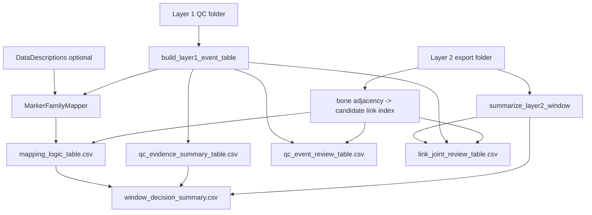

# Five-table pre-JcvPCA segment/joint review backend

## Goal

Refine the backend so one session + one frame window produces exactly five core decision-support tables. No JcvPCA, Layer 3, stats, export, recommendations, plots, or new notebook complexity.

**Scientific guardrails (unchanged):**

- Layer 1 = regional marker-family risk overlay; not proof of link invalidity.
- Layer 2 usable percent = authoritative solved-link usability.
- No arbitrary usable-percent thresholds.
- No recommendation engine.
- DataDescriptions optional and unverified.
- Candidate links are adjacency candidates, never exact affected links.

## Core data flow

## Backend output contract

All five tables written at **top level** of the review output folder, in this **generation order**:

1. `window_decision_summary.csv`
2. `qc_evidence_summary_table.csv`
3. `link_joint_review_table.csv`
4. `qc_event_review_table.csv`
5. `mapping_logic_table.csv` — **always produced**, even if shown lower/collapsed in notebook

Audit/debug (not core product) under `audit/`:

- `combined_qc_events.csv`
- `combined_qc_event_summary.csv`
- `layer1_marker_family_risk.csv`

Also keep: `window_validation_summary.json`, `window_review_report.md`

## 1. Descriptive QC status labels (not recommendations)

**Do not use** `blocked_by_layer2`, `clean_candidate`, `candidate_include`, or other recommendation-style labels as primary status.

**Link table column:** `qc_status_label` with allowed values:

| Label | Meaning |
|-------|---------|
| `no_layer2_problem_observed` | L2 usable frames present; no jump/mask problem flagged in window |
| `layer2_problem_observed` | L2 problem type present (masked frames, jump context, stage07 warn/fail) but link not fully ineligible |
| `fully_layer2_ineligible` | `window_total_frames > 0` **and** `layer2_usable_frames == 0` |
| `unknown_layer2_status` | Missing or ambiguous L2 window data for this link |
| `unknown_mapping` | L1 overlay cannot be mapped to candidate links for this link |
| `review_needed` | Ambiguous case (e.g. provisional scope, manual-review flag) — descriptive prompt, not auto-decision |

`fully_layer2_ineligible` is **not** derived from arbitrary percent thresholds. `review_notes` describes the observed L2 problem type and affected frame counts (e.g. `block_filter; 0/1000 eligible; 61 jump_context`).

**Window summary column rename:**

- Replace `n_layer2_links_below_threshold` → **`n_layer2_links_fully_ineligible`** (in-scope links where `window_total_frames > 0` and `layer2_usable_frames == 0`).
- Keep **`layer2_mean_usable_percent`** and **`layer2_min_usable_percent`** as descriptive only (no threshold logic).

## 2. Candidate mapping levels (cautious labeling)

Bone→link index is **candidate adjacency mapping**, not exact proof that a marker invalidates a link.

**New column in `mapping_logic_table.csv`:** `candidate_mapping_level`

| Value | When |
|-------|------|
| `exact_bone_adjacency_candidate` | Labeled marker maps (via DataDescriptions or heuristic) to `attached_bone_canonical`, and that bone appears as parent or child on Layer 2 link manifest rows |
| `regional_family_proxy` | Mapping is only by joint family / body region, without bone adjacency to a manifest link |
| `segment_pair_regional` | Segment-pair input (e.g. `ChestTop__WaistCBack`); union candidates from both component markers; elevated uncertainty |
| `unmapped_unknown` | Labeled marker present but no bone/family mapping; **retained in table**, not silently dropped |
| `unlabeled_excluded` | Unlabeled evidence; excluded from main review tables |

**Rules:**

- Never describe candidate links as exact affected links in column names or notes.
- `candidate_layer2_links` / `candidate_layer2_link_ids` always paired with `candidate_mapping_level`.
- Unlabeled-marker evidence excluded from main review UX (`unlabeled_marker_evidence_included=false` in window summary).

## 3. Notebook display order

Notebook shows the five core tables only (audit behind optional checkbox). **Display order:**

1. `window_decision_summary.csv` — what entered the review
2. `qc_evidence_summary_table.csv` — QC burden by type
3. `link_joint_review_table.csv` — per-link decision support (**main scientist-facing decision table**)
4. `qc_event_review_table.csv` — detailed event evidence (lower / collapsible)
5. `mapping_logic_table.csv` — mapping audit (lower / collapsible; always generated by backend)

First three = primary decision tables. Last two = detailed evidence/audit tables.

No new widgets; no plots/export/recommendations.

## Schema changes — [`schemas.py`](src/layer2_motive/segmentation/schemas.py)

Add column tuples:

- `WINDOW_DECISION_SUMMARY_COLUMNS` (includes `n_layer2_links_fully_ineligible`, not `n_layer2_links_below_threshold`)
- `MAPPING_LOGIC_TABLE_COLUMNS` (includes `candidate_mapping_level`)
- `QC_EVIDENCE_SUMMARY_TABLE_COLUMNS`
- `QC_EVENT_REVIEW_TABLE_COLUMNS`
- `LINK_JOINT_REVIEW_TABLE_COLUMNS` (includes `qc_status_label`, `review_notes`; no `recommendation_placeholder`)

Add frozen sets:

- `QC_STATUS_LABELS` — the six descriptive labels above
- `CANDIDATE_MAPPING_LEVELS` — the five mapping levels above

Keep existing audit column tuples for `audit/` outputs.

## Builder changes — [`window_summary.py`](src/layer2_motive/segmentation/window_summary.py)

- `build_bone_to_links_index(link_manifest)` — adjacency index only; document as candidate, not exact.
- `build_mapping_logic_table(...)` — one row per distinct marker/region/segment-pair; sets `candidate_mapping_level` per rules above.
- `build_qc_evidence_summary_table(...)` — one row per allowed QC type.
- `build_link_joint_review_table(...)` — frame counts from `per_link_summary`; L1 overlay via candidate links; `qc_status_label` via descriptive rules; `review_notes` with L2 problem type + counts.
- `build_qc_event_review_table(...)` — L1 labeled-marker only; allowed QC types only.
- `build_window_decision_summary(...)` — full window intake row including `n_layer2_links_fully_ineligible`.
- `write_window_review_outputs(...)` — write five core CSVs in fixed order; audit under `audit/`.

**Remove / stop writing** at top level: `window_qc_summary_display.csv`, `qc_event_display.csv`, `layer2_link_scope_display.csv`, `combined_qc_event_summary.csv`, `layer1_marker_family_risk.csv`.

## Wiring — [`notebook_review.py`](src/layer2_motive/segmentation/notebook_review.py)

- `CORE_TABLE_FILES` map with five new filenames.
- Update `ReviewOutputs`, `load_review_outputs`, `collect_output_paths`.
- Scientist display helpers align with new columns (`qc_status_label` not `Status` from recommendation placeholder).
- Input summary sourced from `window_decision_summary`.

## CLI — [`review_segmentation_window.py`](scripts/review_segmentation_window.py)

Print the five core output paths in order; mention `audit/` for full trace.

## Tests — `tests/`

- `qc_status_label`: `fully_layer2_ineligible` only when `usable_frames == 0` and `window_total_frames > 0`; no percent-threshold tests.
- `candidate_mapping_level` rules for bone adjacency vs family proxy vs segment-pair vs unmapped vs unlabeled.
- `mapping_logic_table` always written.
- Notebook load order matches display order.
- Run `pytest` and `ruff check src tests scripts`.
