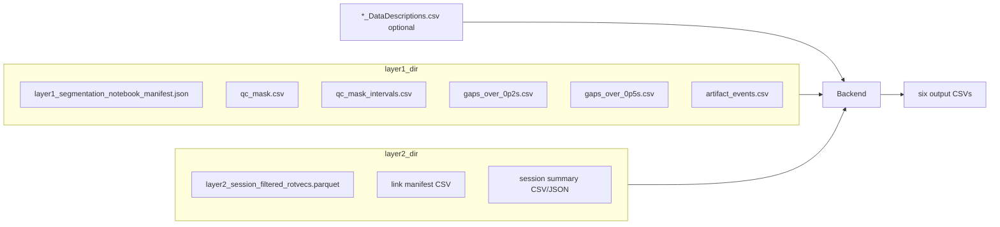

# Pre-JcvPCA Segment/Joint Review — Implementation Plan

Evaluated **only** from [`reevluate_project/`](reevluate_project/) + [`revised_pre_jvcpca_review_tables.md`](reevluate_project/revised_pre_jvcpca_review_tables.md). Current `post_layer2_segmentation_review` code is **not** assumed.

---

## 1. Input contract (from actual files)

### Folder auto-discovery

The CLI takes `--layer1-dir`, `--layer2-dir`, optional `--datadescriptions`, and resolves files by **preferred spec name first**, then known aliases in the same folder.



### Layer 1 folder — [`reevluate_project/`](reevluate_project/)

| File | Status in bundle | Key columns / data | Output tables fed | Role |
|---|---|---|---|---|
| [`layer1_segmentation_notebook_manifest.json`](reevluate_project/layer1_segmentation_notebook_manifest.json) | **Required** | `run_key`, `session_id`, `frame_rate_hz`, `n_frames`, `frame_index_column` | All (session/window metadata) | Session identity, fps, frame bounds validation |
| [`qc_mask.csv`](reevluate_project/qc_mask.csv) | **Required** | `frame`, `flag_gap_0p2`, `flag_gap_0p5`, `flag_artifact_sigma`, `flag_segment_swap` | `window_decision_summary.csv` | Window-level **flagged-frame percentages** per QC type |
| [`gaps_over_0p2s.csv`](reevluate_project/gaps_over_0p2s.csv) | **Preferred** (present) | `marker_name`, `body_region_group`, `gap_intervals_s` (time ranges, not frames) | `mapping_logic_table.csv`, `qc_evidence_summary_table.csv`, `qc_event_review_table.csv`, `link_joint_review_table.csv`, `window_decision_summary.csv` | Labeled-marker gap ≥0.2s events (after interval expansion) |
| [`gaps_over_0p5s.csv`](reevluate_project/gaps_over_0p5s.csv) | **Preferred** (present) | same as 0.2s | same | Labeled-marker gap ≥0.5s events |
| [`artifact_events.csv`](reevluate_project/artifact_events.csv) | **Preferred** (present) | `start_frame`, `end_frame`, `duration_frames`, `marker_name`, `body_region_group`, `method` (`velocity_mad`, `segment_length_violation`) | same L1 tables | `artifact_sigma` + `segment_swap` event rows (frame-native) |
| [`qc_mask_intervals.csv`](reevluate_project/qc_mask_intervals.csv) | **Fallback only** | `start_frame`, `end_frame`, `affected_markers`, boolean flags | L1 tables **only if** dedicated gap/artifact files missing | Interval-level backup; **do not merge** when gap/artifact files exist (avoids double-counting) |

**Not required for core tables:** [`671_T1_P1_R1_Take ..._001.csv`](reevluate_project/671_T1_P1_R1_Take%202026-01-06%2003.57.12%20PM_001.csv) (optional labeled-marker inventory cross-check only).

### Layer 2 folder — [`reevluate_project/`](reevluate_project/)

| File | Status in bundle | Key columns / data | Output tables fed | Role |
|---|---|---|---|---|
| [`layer2_session_filtered_rotvecs.parquet`](reevluate_project/layer2_session_filtered_rotvecs.parquet) | **Required** | Long format: one row per `(frame, link_id)`; 44 cols including `frame`, `link_id`, `parent_canonical`, `child_canonical`, `stage07_jump_status`, `stage08_filter_status`, `stage08_mask_reason`, `stage08_analysis_eligible` | `window_decision_summary.csv`, `link_joint_review_table.csv` | Per-frame Layer 2 problem evidence |
| Link manifest | **Required** (alias) | **Spec name:** `layer2_session_link_manifest.csv`. **Actual file:** [`layer2_qc_link_manifest.csv`](reevluate_project/layer2_qc_link_manifest.csv) with `link_id`, `parent_canonical`, `child_canonical`, `feature_scope`, `stage07_jump_status`, `stage08_policy` | `mapping_logic_table.csv`, all tables with link lists / joint selection | Authoritative link index (51 links in this session) |
| Session summary | **Required** (alias) | **Spec name:** `layer2_session_summary.json`. **Actual file:** [`layer2_qc_session_manifest.csv`](reevluate_project/layer2_qc_session_manifest.csv) with `session_id`, `run_label`, `frame_count`, `sampling_rate_hz` | `window_decision_summary.csv` | Session/run metadata |
| [`filtered_relative_rotation_vectors.parquet`](reevluate_project/filtered_relative_rotation_vectors.parquet) | Duplicate alias | Same size as spec parquet | Same | Accept as alternate filename only |

### Optional mapping — [`671_T1_P1_R1_Take ..._DataDescriptions.csv`](reevluate_project/671_T1_P1_R1_Take%202026-01-06%2003.57.12%20PM_001_DataDescriptions.csv)

| Status | Key rows | Output tables | Role |
|---|---|---|---|
| **Recommended** (present) | `Bone Marker,<name>,<bone_id>,...`; `Bone,<bone_id>,<parent_idx>,...` (54 bone markers) | `mapping_logic_table.csv` + all L1 tables needing mapping | Marker→bone→candidate links; bone tree for segment-pair regional mapping |

If absent: fall back to heuristic marker-name/body-region mapping; mark `mapping_source=heuristic`, lower confidence in `review_note`.

---

## 2. Output-table mapping

### Shared preprocessing (all tables)

**Labeled-marker rule (strict):**
- **Include:** `671:<Name>` single markers; segment pairs `A__B` where **both** components appear as `Bone Marker` rows in DataDescriptions (all 8 pairs in this session’s artifact file qualify).
- **Exclude:** `Unlabeled <id>` and any marker/pair failing the labeled test. Never silently drop labeled-but-unmapped markers.

**Marker inventory for `mapping_logic_table.csv`:**
- Base set = 54 DataDescriptions bone markers (normalized to both `671:Name` and bare `Name`).
- Union any labeled markers appearing in gap/artifact/qc sources not in DD → retained as `mapping_status=unmapped`.

**Joint family (`related_joint_family` / `joint_family`):**
- Primary: `body_region_group` from L1 event files (`elbow_forearm`, `wrist_hand`, `head_neck`, …).
- Enrich with laterality from marker/bone prefix (`L`/`R`) → spec-style names (`left_elbow_forearm`, …) via a small static map.
- Segment pairs: join component families with `;`.

**Candidate link mapping:**
- **Single marker (bone-adjacent):** from DD bone → canonical bone (strip `671_`) → all manifest links where `parent_canonical` or `child_canonical` matches.
- **Segment pair (regional):** build bone tree from DD `Bone` rows → path between component bones → union of links on path + incident links; `candidate_mapping_level=segment_pair_regional`.

**Window clip:** for `[frame_start, frame_end]`, clip event intervals; recompute `duration_frames = end - start + 1`.

**Gap interval expansion** (required because gap CSVs lack frames):
- Parse `gap_intervals_s` tokens like `128.03-128.42`.
- Convert: `start_frame = round(start_s * fps)`, `end_frame = round(end_s * fps)` using manifest fps (120 Hz here).
- **Uncertainty:** ±1 frame vs Layer 1 frame-native artifact events — document in outputs; configurable rounding mode in tests.

---

### [`mapping_logic_table.csv`](reevluate_project/revised_pre_jvcpca_review_tables.md) (Table 0 — session-level, no window)

| Column | Source | Computation |
|---|---|---|
| `raw_marker_or_region` | DD + L1 sources | Marker/pair name as seen in evidence |
| `normalized_marker_or_region` | computed | Strip `671:` prefix |
| `component_markers` | computed | Split `__` pairs; blank for singles |
| `attached_bone`, `attached_bone_canonical` | DD `Bone Marker` / heuristic | DD bone id → canonical |
| `marker_family`, `related_joint_family` | L1 `body_region_group` + laterality map | See shared rules |
| `candidate_layer2_links`, `candidate_layer2_link_ids` | link manifest + mapping logic | Formatted `J005 LUArm->LFArm` strings |
| `mapping_source` | computed | `datadescriptions` / `heuristic` / `regional_pair` / `unmapped` |
| `mapping_status` | computed | `mapped` if bone or regional mapping succeeded else `unmapped` |
| `candidate_mapping_level` | computed | `bone_adjacency_candidate`, `segment_pair_regional`, or `unmapped_unknown` |
| `included_in_review` | computed | `true` for all labeled rows (mapped + unmapped) |
| `review_note` | computed | Short text for unmapped/uncertain cases |

**Inputs:** DataDescriptions, link manifest, labeled markers from L1 files (inventory only).

---

### [`window_decision_summary.csv`](reevluate_project/revised_pre_jvcpca_review_tables.md) (Table 1 — one row)

| Column | Source | Computation |
|---|---|---|
| `session_id`, `run_label` | L1 manifest + L2 session manifest | Prefer L2 session manifest |
| `frame_start`, `frame_end`, `duration_frames`, `duration_sec` | CLI + manifest fps | `duration_frames = end - start + 1`; `duration_sec = duration_frames / fps` |
| `selected_qc_evidence_types` | CLI `--qc-evidence` | Semicolon-joined |
| `joint_selection_preset` | CLI optional | e.g. filter manifest links where `feature_scope=core_candidate` (16 links here) |
| `selected_layer2_links`, `selected_layer2_link_ids` | CLI `--selected-links` + manifest | Display names `Parent->Child` |
| `layer1_labeled_marker_source` | computed | e.g. `DataDescriptions + Layer1 event files` |
| `layer1_total_labeled_markers`, `layer1_mapped_labeled_markers` | mapping table | Counts |
| `layer1_unmapped_labeled_marker_names` | mapping table | Semicolon list of names |
| `unlabeled_marker_policy` | constant | `excluded_from_main_review` |
| `layer2_total_links_available` | link manifest row count | 51 |
| `layer2_selected_links_count` | CLI selection | |
| `datadescriptions_used`, `mapping_source_summary` | mapping pass | |
| `n_gap_0p5_events`, `n_gap_0p2_events`, `n_artifact_sigma_events`, `n_segment_swap_events` | normalized L1 events in window | Filter by selected QC types + labeled-only |
| `gap_*_flagged_frame_percent`, etc. | `qc_mask.csv` window slice | `100 * sum(flag) / duration_frames` |
| `jump_fail_rad_links_frame_percent`, `block_filter_links_frame_percent` | parquet + selected links | Per-link formatted strings — see **Layer 2 flag mapping** below |

---

### [`qc_evidence_summary_table.csv`](reevluate_project/revised_pre_jvcpca_review_tables.md) (Table 2)

One row per selected `qc_type` (`gap_0p5`, `gap_0p2`, `artifact_sigma`, `segment_swap`).

| Column | Computation |
|---|---|
| `event_count` | Count normalized labeled events in window |
| `total_event_duration_frames` | Sum of `duration_frames` (not unique frames) |
| `total_event_duration_percent_of_window` | `100 * total_duration / duration_frames` |
| `unique_marker_or_region_count`, `markers_or_regions` | Distinct raw names |
| `related_joint_families` | Mapped families involved |
| `mapping_status_summary` | e.g. `mapped:4; unmapped:0` |
| `source_files` | Which L1 file(s) supplied events |

**QC type normalization:**
- `gaps_over_0p5s.csv` → `gap_0p5`
- `gaps_over_0p2s.csv` → `gap_0p2`
- `artifact_events.csv` + `method=velocity_mad` → `artifact_sigma`
- `artifact_events.csv` + `method=segment_length_violation` → `segment_swap`

---

### [`link_joint_review_table.csv`](reevluate_project/revised_pre_jvcpca_review_tables.md) (Table 3)

One row per **user-selected** link.

| Column | Computation |
|---|---|
| `link_id`, `link_or_joint` | manifest |
| `joint_family` | from parent/child canonical bones + laterality map |
| `l1_regional_*_event_frames` | Sum `duration_frames` of window events whose **candidate links** include this link (regional attribution) |
| `l1_regional_*_event_percent` | `100 * frames / duration_frames` |
| `layer2_ineligible_jump_fail_rad_frame_percent` | parquet window slice — see flag mapping |
| `layer2_ineligible_block_filter_frame_percent` | parquet window slice — see flag mapping |
| `mapped_qc_marker_names_related_to_link` | Names of mapped labeled markers with this link in candidates |
| `layer2_problem_notes` | Descriptive counts only (e.g. `61 jump_fail_rad frames`) |

---

### [`qc_event_review_table.csv`](reevluate_project/revised_pre_jvcpca_review_tables.md) (Table 4)

One row per normalized labeled event overlapping window.

| Column | Source / computation |
|---|---|
| `frame_start`, `frame_end`, `duration_frames` | event row (after clip) |
| `qc_type`, `reason`, `source_file` | normalized |
| `raw_marker_or_region`, `related_joint_family` | event + mapping |
| `candidate_layer2_links`, `candidate_mapping_level`, `mapping_status` | mapping pass |
| `included_in_review` | `true` for labeled rows included by QC type filter |

---

## Layer 2 flag mapping (critical — needs approval)

Spec names **`jump_fail_rad`** and **`block_filter`**, but parquet has **no columns with those exact names**. Actual per-frame fields in [`layer2_session_filtered_rotvecs.parquet`](reevluate_project/layer2_session_filtered_rotvecs.parquet):

- `stage07_jump_status` ∈ {pass, warning, fail}
- `stage08_filter_status` ∈ {pass, filtered_but_jump_context_masked, excluded_from_analysis, …}
- `stage08_mask_reason` ∈ {`''`, `stage07_jump_context`, `excluded_feature_scope`, …}
- Link-level `stage07_jump_status` in manifest (e.g. J007=fail, J005=warning)

**Proposed default (matches spec demo pattern for J007/J005/J020 qualitatively):**

| Spec term | Proposed parquet predicate (per frame, per selected link) |
|---|---|
| `jump_fail_rad` | `stage08_mask_reason == 'stage07_jump_context'` **AND** link manifest `stage07_jump_status == 'fail'` |
| `block_filter` | If link manifest `stage07_jump_status == 'fail'`: `stage08_filter_status == 'filtered_but_jump_context_masked'`; else: `stage08_analysis_eligible == False` |

Percent = `100 * count(predicate) / duration_frames`.

**Caveats (must approve before coding):**
- Spec demo numbers (e.g. J005 block 0.3%) are **illustrative**; with the proposed rules J005 block ≈ 6.1% in window 16000–17000. Implementation reports **actual computed percents**, not demo values.
- If Layer 2 team has canonical flag definitions, replace predicates in one config module (`layer2_flags.py`).

---

## 3. Implementation strategy — **Option A: new small backend**

**Why not reuse current program:** user requested architecture reset; existing notebook review has different outputs, display tables, and coupling. A fresh `src/pre_jvcpca_review/` package (~800–1200 LOC) is faster to reason about than refactoring legacy paths.

**Why not pure script:** six tables share mapping + event normalization; small package with pure functions keeps notebook thin and tests easy.

**Optional later hybrid:** if existing repo has generic CSV/parquet helpers, import only after new logic is correct.

---

## 4. Backend script design

**Entry:** [`scripts/build_pre_jvcpca_review.py`](scripts/build_pre_jvcpca_review.py)

```bash
python scripts/build_pre_jvcpca_review.py \
  --layer1-dir reevluate_project \
  --layer2-dir reevluate_project \
  --datadescriptions "reevluate_project/671_T1_P1_R1_Take 2026-01-06 03.57.12 PM_001_DataDescriptions.csv" \
  --start-frame 16000 \
  --end-frame 17000 \
  --selected-links J005,J007,J020 \
  --qc-evidence gap_0p5,gap_0p2,artifact_sigma,segment_swap \
  --out outputs/pre_jvcpca_review/session_window
```

**Two modes:**
1. **`--mapping-only`** → writes only `mapping_logic_table.csv` (no window/links required beyond validation).
2. **Full review** → requires window + `--selected-links`; writes all six CSVs.

**Package layout:**
- `discovery.py` — resolve files + aliases
- `load_layer1.py`, `load_layer2.py` — parsers
- `mapping.py` — DD parse, bone tree, candidate links, joint families
- `events.py` — gap expansion, artifact normalization, labeled filter, window clip
- `layer2_flags.py` — approved flag predicates
- `tables.py` — assemble DataFrames, write CSV with exact spec column order
- `schemas.py` — column lists for validation/tests

**Fail-fast validation:** missing required files, invalid link IDs, frame range outside session, empty selected-link set.

---

## 5. Notebook design

**New notebook:** [`notebooks/pre_jvcpca_review.ipynb`](notebooks/pre_jvcpca_review.ipynb) (replace/ignore old review notebook).

No plotting, no hidden transforms, no recommendation logic.

---

### 5a. User input widget variables (all notebook config)

Single config cell at top. Plain Python variables (ipywidgets optional but not required).

| Variable | Widget type | Default (this session) | Purpose |
|---|---|---|---|
| `LAYER1_DIR` | `Text` / path string | `reevluate_project/` | Folder with Layer 1 QC files |
| `LAYER2_DIR` | `Text` / path string | `reevluate_project/` | Folder with Layer 2 parquet + manifests |
| `DATADESCRIPTIONS_PATH` | `Text` / path string (optional) | `reevluate_project/671_T1_P1_R1_Take 2026-01-06 03.57.12 PM_001_DataDescriptions.csv` | Marker→bone mapping; blank = heuristic fallback |
| `OUTPUT_DIR` | `Text` / path string | `outputs/pre_jvcpca_review/671_T1_P1_R1_16000_17000/` | Where backend writes CSVs |
| `FRAME_START` | `IntText` | `16000` | Window start (inclusive) |
| `FRAME_END` | `IntText` | `17000` | Window end (inclusive) |
| `SELECTED_QC_EVIDENCE` | `SelectMultiple` | `["gap_0p5", "gap_0p2", "artifact_sigma", "segment_swap"]` | Which L1 evidence types enter review |
| `JOINT_SELECTION_PRESET` | `Dropdown` | `None` (choices: `None`, `core_candidate`, `all_links`) | Optional preset; `core_candidate` = 16 links with `feature_scope=core_candidate` |
| `SELECTED_LINK_IDS` | `SelectMultiple` | `["J005", "J007", "J020"]` | User-chosen Layer 2 links **after** viewing mapping table |

**Derived at runtime (read-only, not user-edited):**
- `SESSION_ID` ← L2 session manifest (`671_T1_P1_R1`)
- `RUN_LABEL` ← L2 session manifest
- `FPS` ← L1 manifest (`120.0`)
- `N_FRAMES` ← L1 manifest (`30604`)
- `AVAILABLE_LINKS` ← parsed from link manifest → list of `{link_id, label}` e.g. `J007 LFArm->LHand`
- `MAPPING_CSV` = `{OUTPUT_DIR}/mapping_logic_table.csv`

**Files auto-discovered inside folders (user does not pick individually):**

Layer 1 (`LAYER1_DIR`):
- `layer1_segmentation_notebook_manifest.json` *(required)*
- `qc_mask.csv` *(required)*
- `gaps_over_0p2s.csv`, `gaps_over_0p5s.csv`, `artifact_events.csv` *(preferred)*
- `qc_mask_intervals.csv` *(fallback only)*

Layer 2 (`LAYER2_DIR`):
- `layer2_session_filtered_rotvecs.parquet` *(required; alias: `filtered_relative_rotation_vectors.parquet`)*
- `layer2_session_link_manifest.csv` *(required; alias: `layer2_qc_link_manifest.csv`)*
- `layer2_session_summary.json` *(required; alias: `layer2_qc_session_manifest.csv`)*

**Notebook flow:**

| Step | Action | Backend call |
|---|---|---|
| 1 | Set folder/path widgets above | — |
| 2 | Run mapping | `--mapping-only` |
| 3 | Display `mapping_logic_table.csv` | read CSV |
| 4 | User picks `SELECTED_LINK_IDS` (+ optional preset) | — |
| 5 | Set frame window + QC types; run full review | full CLI |
| 6 | Display 5 review tables in order (below) | read CSVs |

---

### 5b. How the six output tables look (display order)

**Note:** Spec defines **6 CSV files**. Step 3 shows **Table 0** (mapping) before joint selection. After selection, the notebook shows **5 review tables** (Tables 1–5 below).

Example session: `671_T1_P1_R1`, window `16000–17000` (1001 frames), links `J005,J007,J020`, all QC types selected. Values below are **structure + realistic previews** from [`reevluate_project/`](reevluate_project/); exact gap-event counts depend on approved time→frame expansion.

---

#### Table 0 — `mapping_logic_table.csv` *(shown before joint selection; ~54 rows)*

| raw_marker_or_region | normalized_marker_or_region | component_markers | attached_bone | attached_bone_canonical | marker_family | related_joint_family | candidate_layer2_links | candidate_layer2_link_ids | mapping_source | mapping_status | candidate_mapping_level | included_in_review | review_note |
|---|---|---|---|---|---|---|---|---|---|---|---|---|---|
| 671:LWristOut | LWristOut | | 671_LFArm | LFArm | elbow_forearm | left_elbow_forearm | J005 LUArm->LFArm; J007 LFArm->LHand | J005; J007 | datadescriptions | mapped | bone_adjacency_candidate | true | |
| 671:LHandIn | LHandIn | | 671_LHand | LHand | wrist_hand | left_wrist_hand | J007 LFArm->LHand | J007 | datadescriptions | mapped | bone_adjacency_candidate | true | |
| ChestTop__WaistCBack | ChestTop__WaistCBack | ChestTop; WaistCBack | mixed | mixed | trunk_chest; pelvis_waist | trunk_chest; pelvis_hip | J002 671->Ab; J003 Ab->Chest | J002; J003 | datadescriptions | mapped | segment_pair_regional | true | regional pair, not exact link evidence |
| 671:UnknownMarker | UnknownMarker | | unknown | unknown | unknown | unknown | | | unmapped | unmapped | unmapped_unknown | true | retained as unknown labeled marker |

*One row per labeled marker/region in inventory. Unlabeled markers never appear.*

---

#### Table 1 — `window_decision_summary.csv` *(1 row)*

| session_id | run_label | frame_start | frame_end | duration_frames | duration_sec | selected_qc_evidence_types | joint_selection_preset | selected_layer2_links | selected_layer2_link_ids | layer1_labeled_marker_source | layer1_total_labeled_markers | layer1_mapped_labeled_markers | layer1_unmapped_labeled_marker_names | unlabeled_marker_policy | layer2_total_links_available | layer2_selected_links_count | datadescriptions_used | mapping_source_summary | n_gap_0p5_events | n_gap_0p2_events | n_artifact_sigma_events | n_segment_swap_events | gap_0p5_flagged_frame_percent | gap_0p2_flagged_frame_percent | artifact_sigma_flagged_frame_percent | segment_swap_flagged_frame_percent | jump_fail_rad_links_frame_percent | block_filter_links_frame_percent |
|---|---|---:|---:|---:|---:|---|---|---|---|---|---:|---:|---|---|---:|---:|---|---|---:|---:|---:|---:|---:|---:|---:|---|---|
| 671_T1_P1_R1 | 671_T1_P1_R1_Take_2026-01-06_03.57.12_PM_001 | 16000 | 17000 | 1001 | 8.34 | gap_0p5; gap_0p2; artifact_sigma; segment_swap | | LUArm->LFArm; LFArm->LHand; LThigh->LShin | J005; J007; J020 | DataDescriptions + Layer1 event files | 54 | 54 | | excluded_from_main_review | 51 | 3 | true | 54 datadescriptions-mapped; 0 unmapped | *(computed)* | *(computed)* | 12 | 1 | 20.8 | 22.1 | 1.2 | 2.0 | J007 LFArm->LHand: 6.1% | J007 LFArm->LHand: 100.0% |

*`jump_fail_rad` / `block_filter` columns are semicolon-separated per-link strings. Percents use approved Layer 2 flag predicates (pending approval).*

---

#### Table 2 — `qc_evidence_summary_table.csv` *(1 row per QC type; up to 4 rows)*

| qc_type | event_count | total_event_duration_frames | total_event_duration_percent_of_window | unique_marker_or_region_count | markers_or_regions | related_joint_families | mapping_status_summary | source_files |
|---|---:|---:|---:|---:|---|---|---|---|
| gap_0p5 | *(computed)* | *(computed)* | *(computed)* | *(computed)* | e.g. 671:LFArm; 671:LElbowOut | left_elbow_forearm; … | mapped:N; unmapped:0 | gaps_over_0p5s.csv |
| gap_0p2 | *(computed)* | *(computed)* | *(computed)* | *(computed)* | e.g. 671:LFArm; 671:ChestTop | … | mapped:N; unmapped:0 | gaps_over_0p2s.csv |
| artifact_sigma | 12 | *(sum durations)* | *(computed)* | *(computed)* | 671:ChestTop; 671:LFArm; … | trunk_chest; left_elbow_forearm; … | mapped:12; unmapped:0 | artifact_events.csv |
| segment_swap | 1 | 20 | 2.0 | 1 | LHandIn__LWristOut | left_wrist_hand | mapped:1; unmapped:0 | artifact_events.csv |

---

#### Table 3 — `link_joint_review_table.csv` *(1 row per selected link)*

| link_id | link_or_joint | joint_family | l1_regional_gap_0p5_event_frames | l1_regional_gap_0p5_event_percent | l1_regional_gap_0p2_event_frames | l1_regional_gap_0p2_event_percent | l1_regional_artifact_sigma_event_frames | l1_regional_artifact_sigma_event_percent | l1_regional_segment_swap_event_frames | l1_regional_segment_swap_event_percent | layer2_ineligible_jump_fail_rad_frame_percent | layer2_ineligible_block_filter_frame_percent | mapped_qc_marker_names_related_to_link | layer2_problem_notes |
|---|---|---:|---:|---:|---:|---:|---:|---:|---:|---:|---:|---:|---|---|
| J005 | LUArm->LFArm | left_elbow_forearm | *(regional sum)* | *(computed)* | *(regional sum)* | *(computed)* | *(regional sum)* | *(computed)* | 0 | 0.0 | 0.0 | *(computed)* | 671:LWristOut; 671:LElbowOut; 671:LFArm | *(descriptive)* |
| J007 | LFArm->LHand | left_wrist_hand | *(regional sum)* | *(computed)* | *(regional sum)* | *(computed)* | *(regional sum)* | *(computed)* | 20 | 2.0 | 6.1 | 100.0 | 671:LWristOut; 671:LHandIn; LHandIn__LWristOut | full-window block_filter; 61 jump_fail_rad frames |
| J020 | LThigh->LShin | left_thigh_knee | 0 | 0.0 | 0 | 0.0 | 0 | 0.0 | 0 | 0.0 | 0.0 | 0.0 | | no Layer 2 problem flags in selected window |

*L1 columns are **regional** (candidate-link attribution), not proof of link invalidity.*

---

#### Table 4 — `qc_event_review_table.csv` *(many rows; one per labeled event in window)*

| frame_start | frame_end | duration_frames | qc_type | reason | source_file | raw_marker_or_region | related_joint_family | candidate_layer2_links | candidate_mapping_level | mapping_status | included_in_review |
|---:|---:|---:|---|---|---|---|---|---|---|---|---|
| 16310 | 16329 | 20 | segment_swap | segment_length_violation | artifact_events.csv | LHandIn__LWristOut | left_wrist_hand | J007 LFArm->LHand | bone_adjacency_candidate | mapped | true |
| 16562 | 16562 | 1 | artifact_sigma | velocity_mad | artifact_events.csv | 671:ChestTop | trunk_chest | J003 Ab->Chest | bone_adjacency_candidate | mapped | true |
| 16581 | 16641 | 61 | gap_0p2 | marker_gap | gaps_over_0p2s.csv | 671:LFArm | left_elbow_forearm | J005 LUArm->LFArm; J007 LFArm->LHand | bone_adjacency_candidate | mapped | true |

*Sorted by `frame_start`. Gap rows expanded from `gap_intervals_s`; artifact rows use native frames.*

---

#### Table 5 — display order summary

| Order | CSV file | When shown | Rows (typical) |
|---|---|---|---|
| 1 | `mapping_logic_table.csv` | Before joint selection | ~54 |
| 2 | `window_decision_summary.csv` | After full review | 1 |
| 3 | `qc_evidence_summary_table.csv` | After full review | 1–4 |
| 4 | `link_joint_review_table.csv` | After full review | = # selected links |
| 5 | `qc_event_review_table.csv` | After full review | tens–hundreds (window-dependent) |

---

## 6. Generalizability

**Will generalize across sessions** when:
- Layer 1 folder keeps manifest + qc_mask + gap/artifact CSV schemas
- Layer 2 folder keeps long-format parquet `(frame, link_id)` + link manifest
- DataDescriptions follows Motive `Bone` / `Bone Marker` layout

**Assumptions / may break:**
| Area | Risk | Mitigation |
|---|---|---|
| Marker naming | `671:` prefix vs bare names | Normalization layer; DD as authority |
| Segment pairs | `A__B` delimiter | Only include if both in DD labeled set |
| Link IDs | J001–J051 style | Read from manifest, never hardcode |
| Templates | T1/T2 vs T3 skeleton/topology | Candidate links only; trunk links flagged provisional in manifest |
| Parquet schema drift | Stage column renames | Central `layer2_flags.py` + schema test on load |
| Gap time→frame | fps rounding | Configurable rounding; note in summary |
| File naming | `layer2_qc_*` vs `layer2_session_*` | Discovery aliases |
| Joint family taxonomy | body_region_group variants | Static enrichment map, extensible |

---

## 7. Risks / missing information

| Issue | Affected outputs | Severity | Minimal fix |
|---|---|---|---|
| **`jump_fail_rad` / `block_filter` column names absent in parquet** | Table 1 L2 columns; Table 3 L2 percent columns | **Blocks exact spec semantics** until approved | Confirm predicate mapping (Section 2) or provide Layer 2 flag glossary |
| **Gap files lack frames** | Gap event rows, regional sums | Medium confidence | Approved time→frame rule; prefer artifact_events frame columns when available |
| **Demo table numbers ≠ this session** | None if we compute from data | Low | Treat demo as schema example only |
| **No `layer2_session_summary.json`** | `run_label` | Non-blocking | Use `layer2_qc_session_manifest.csv` alias |
| **qc_mask_intervals duplicates gap/artifact** | All L1 tables if merged | Non-blocking if fallback-only | Never primary when dedicated files exist |
| **Heuristic mapping without DD** | Mapping columns | Lower confidence | `mapping_source=heuristic`, explicit `review_note` |

---

## 8. Fastest implementation plan (ordered)

1. **Discovery + loaders** — parse manifest, qc_mask, gap/artifact, DD, link manifest, parquet slice
2. **Labeled-marker + mapping** — inventory, bone tree, candidate links → `mapping_logic_table.csv`
3. **Event normalization** — expand gaps, map artifact methods, window clip, labeled filter
4. **Layer 2 flags** — implement approved predicates; per-link window percentages
5. **Tables 2–4** — evidence summary, link review (regional L1 rollups), event detail
6. **Table 1** — window decision one-row summary
7. **CLI** — `--mapping-only` + full mode; write six CSVs
8. **Notebook** — thin wrapper + display
9. **Minimal tests** — fixtures from `reevluate_project/`

**Estimated effort:** 1–2 focused days for backend + notebook + tests (mapping/event logic is the bulk).

---

## 9. Minimal tests

Use pytest + small fixtures copied/sliced from [`reevluate_project/`](reevluate_project/).

| Test | Assert |
|---|---|
| `test_window_filter` | Events outside window excluded; clipped durations correct |
| `test_labeled_only` | `Unlabeled *` and unlabeled pairs excluded from event tables |
| `test_unmapped_retained` | Unknown labeled marker appears in mapping table with `mapping_status=unmapped` |
| `test_candidate_link_mapping` | `671:LWristOut` → J005 and J007 candidates; `ChestTop__WaistCBack` → regional level |
| `test_gap_expansion` | Parsed interval produces plausible `duration_frames` at 120 Hz |
| `test_artifact_qc_types` | `velocity_mad`→`artifact_sigma`; `segment_length_violation`→`segment_swap` |
| `test_layer2_flag_percents` | J007 window 16000–17000: jump_fail_rad ≈ 6.1% under approved predicate |
| `test_output_schemas` | Each CSV column set + order matches spec |

---

## Approval needed before coding

1. **Layer 2 flag predicates** (`jump_fail_rad`, `block_filter`) — confirm proposed mapping or provide authoritative definitions.
2. **Gap time→frame rounding** — default `round(time * fps)` acceptable?
3. **Regional segment-pair links** — bone-path via DataDescriptions tree (vs simpler union-of-components).
