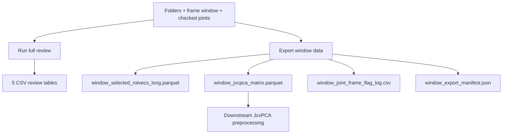

# Window Export for JcvPCA — Revised Plan

## Mission

Export one selected frame window and selected Layer 2 links/joints into **four files**:

| Output file | Format | Role |
|---|---|---|
| `window_selected_rotvecs_long.parquet` | Parquet | Canonical long-format rotvec export (audit, joins, reshaping) |
| `window_jvcpca_matrix.parquet` | Parquet | Wide **frames × features** matrix for downstream JcvPCA preprocessing |
| `window_joint_frame_flag_log.csv` | CSV | Frame × selected-link QC sidecar (L1 + L2 flags) |
| `window_export_manifest.json` | JSON | Reproducibility manifest |

**Separation from review backend (required):**

```text
Run full review  →  five review CSV tables only
Export window data  →  four model-input files only
```

No auto-export during full review. Dedicated **Export window data** button in notebook.



---

## Notebook UX

Update [`notebooks/pre_jvcpca_review.ipynb`](notebooks/pre_jvcpca_review.ipynb):

| Button | Produces |
|---|---|
| **Run mapping table** | `mapping_logic_table.csv` (joint-scoped) |
| **Run full review** | 5 CSV review tables — **no export files** |
| **Export window data** (new) | 4 export files |
| **Show review tables** | Display CSV review outputs |

**Export window data** button must:

1. Validate folder paths, frame window, ≥1 selected link
2. Call `export_window_for_jvcpca()`
3. Display paths to all four export files
4. Display row counts and matrix shape (`n_frames × n_columns`)
5. Display **`selected_link_order`** (resolved manifest order) and primary rotvec columns
6. Preview first N rows of `window_joint_frame_flag_log.csv`
7. Preview first N rows/columns of `window_jvcpca_matrix.parquet` (small slice only)

**Do not:** display full long parquet, add plots, run JcvPCA, center/scale matrix.

---

## 1. Long-format rotvec export

### File: `window_selected_rotvecs_long.parquet`

**Purpose:** Canonical selected-window, selected-link, long-format rotvec export. Useful for audit, validation, reconstruction, joins with flag log, and downstream reshaping. **Not** the final JcvPCA feature matrix.

**Shape:**

```text
rows = duration_frames × n_selected_links
duration_frames = frame_end - frame_start + 1
```

**Required columns (exact order on write):**

```text
session_id, run_label, frame, time_sec, link_id,
parent_canonical, child_canonical, link_or_joint, joint_family, feature_scope,

rx_raw, ry_raw, rz_raw, rotvec_norm_raw,
rx_filtered_native, ry_filtered_native, rz_filtered_native, rotvec_norm_filtered_native,
rx_filtered_analysis, ry_filtered_analysis, rz_filtered_analysis, rotvec_norm_filtered_analysis
```

**Context column sources:**
- `link_or_joint`: `LinkRecord.display_name` (`parent->child`) — same as review tables
- `joint_family`: [`link_joint_family(link)`](src/pre_jvcpca_review/mapping.py)

**Exclude:** All L2 QC/status columns (`stage04_*` … `stage08_*`, `included_in_v0`, `requires_manual_review`, etc.)

**Source:** [`layer2_session_filtered_rotvecs.parquet`](reevluate_project/layer2_session_filtered_rotvecs.parquet) via pyarrow column projection + row filter (extend [`load_rotvecs_window`](src/pre_jvcpca_review/load_layer2.py)).

**Sorting:** `frame` ascending, then link rows in **`selected_link_order`** (not checkbox order, not alphabetical `link_id`). Frame-contiguous for matrix pivot.

---

## 1b. Selected link order (stable and explicit)

`selected_link_order` drives matrix feature order, long/flag-log row ordering within each frame, and manifest reproducibility. It must always be resolved explicitly before any export write.

### Resolution rules

| Input source | Default behavior | Custom order |
|---|---|---|
| Notebook checkboxes | Reorder checked IDs to **Layer 2 link_manifest row order** | Not available in V1 (no drag-and-drop) |
| CLI `--selected-links` | Reorder to **manifest order** (same set) | Use `--preserve-selected-link-order` to keep CLI list order |
| API `export_window_for_jvcpca()` | Reorder `selected_link_ids` to manifest order | Pass `selected_link_order=[...]` **or** `preserve_input_link_order=True` |

```python
def resolve_selected_link_order(
    selected_link_ids: list[str],
    manifest_links: list[LinkRecord],
    *,
    selected_link_order: list[str] | None = None,
    preserve_input_link_order: bool = False,
) -> list[str]:
    """
    1. Validate all selected_link_ids exist in manifest.
    2. If selected_link_order provided explicitly → use it (must match selected set exactly).
    3. Elif preserve_input_link_order → use selected_link_ids list order as-is.
    4. Else → manifest order: [link.link_id for link in manifest_links if link.link_id in selected_set].
    """
```

**Invariants:**
- `selected_link_order` is always a non-empty list with no duplicates.
- Set(`selected_link_order`) == Set(`selected_link_ids`).
- Order is stable across reruns given the same manifest and selection inputs.
- Notebook **never** passes checkbox dict iteration order directly; always calls `resolve_selected_link_order`.

### Manifest requirement (mandatory)

Always write both fields to `window_export_manifest.json`:

```json
"selected_link_order": ["J005", "J007", "J020"],
"feature_order": [
  "J005_LUArm_to_LFArm_rx",
  "J005_LUArm_to_LFArm_ry",
  "J005_LUArm_to_LFArm_rz",
  "..."
]
```

Also record how order was chosen:

```json
"selected_link_order_source": "manifest_order"
```

Allowed values: `manifest_order` | `explicit_selected_link_order` | `preserve_input_link_order`.

---

## 2. Wide JcvPCA input matrix

### File: `window_jvcpca_matrix.parquet`

**Purpose:** Direct input shape for downstream JcvPCA preprocessing — **frames × features**. One row per frame; each feature is one selected link-axis component.

**Not in scope:** PCA fitting, centering, z-scoring, scaling, or any JcvPCA execution.

**Shape:**

```text
rows    = duration_frames
columns = 4 identity + 3 × n_selected_links
        = session_id, run_label, frame, time_sec + feature columns
```

**Feature source columns (only these):**

```text
rx_filtered_analysis
ry_filtered_analysis
rz_filtered_analysis
```

Do **not** use raw or filtered-native for the matrix unless explicitly requested later.

### Feature naming policy (single policy — enforced)

**One naming policy only.** No alternate formats, no silent renames, no optional readable variants.

```text
FEATURE_NAMING_POLICY = "link_id_parent_to_child_axis"

Template:
  {link_id}_{parent_canonical}_to_{child_canonical}_{axis}

Axes (fixed order per link): rx, ry, rz
```

Example for J005 (LUArm→LFArm):

```text
J005_LUArm_to_LFArm_rx
J005_LUArm_to_LFArm_ry
J005_LUArm_to_LFArm_rz
```

**Enforcement (before any file write):**

1. Build expected feature names from `selected_link_order` + manifest `LinkRecord` fields.
2. Compare expected names to actual matrix column names (excluding identity columns).
3. If any mismatch — wrong format, missing name, extra column, duplicate — **abort export** with `WindowExportError` listing expected vs actual.
4. Do **not** write any of the four export files on naming failure (atomic failure).

Manifest must record:

```json
"feature_naming_policy": "link_id_parent_to_child_axis",
"feature_order": ["J005_LUArm_to_LFArm_rx", "..."]
```

**Feature order:** Follow **`selected_link_order`** (see §1b). Within each link: `rx`, `ry`, `rz`. `feature_order` is always saved in manifest and must match matrix columns exactly.

### Matrix pivot logic

```python
def build_jvcpca_matrix(
    long_df: pd.DataFrame,
    selected_links: list[LinkRecord],
    selected_link_order: list[str],
) -> tuple[pd.DataFrame, list[str]]:
    """
    1. Assert long_df sorted by frame, then selected_link_order index.
    2. validate_complete_frame_link_grid(long_df, frames, selected_link_order).
    3. Build feature columns via FEATURE_NAMING_POLICY only.
    4. validate_feature_column_names(matrix_df, selected_links, selected_link_order) — abort if mismatch.
    3. For each frame, pivot selected links into wide feature columns.
    4. Identity cols: session_id, run_label, frame, time_sec (one value per frame).
    5. Return (matrix_df, feature_order).
    """
```

Implementation approach:

1. Derive expected frame list: `range(frame_start, frame_end + 1)`.
2. Before pivot: assert every `(frame, link_id)` pair exists exactly once in long slice.
3. Group by `frame`; for each link in `selected_link_order`, assign three columns from filtered-analysis rotvecs.
4. Assert one row per frame after pivot; frames sorted ascending; no duplicate frames.
5. Assert `len(feature_columns) == 3 * len(selected_link_order)`.

Alternative implementation: `long_df.pivot(index="frame", columns="link_id", values=[rx, ry, rz])` then flatten/rename — but explicit loop or ordered melt/pivot is preferred for stable column naming.

### Matrix validation (before write)

| Check | Rule |
|---|---|
| Row count | `== duration_frames` |
| One row per frame | No duplicates |
| Frames sorted | Ascending |
| Complete grid pre-pivot | All selected links present for every frame |
| Feature count | `== 3 × n_selected_links` |
| Feature order | Matches `selected_link_order`; saved in manifest |
| Feature naming | All feature cols match `link_id_parent_to_child_axis`; else abort |
| NaN policy | Fail fast unless `allow_nan_matrix=True` |
| Non-null identity | `session_id`, `frame` non-null on all matrix rows |

**NaN handling (V1):**

- If any model feature column contains NaN → raise `WindowExportError` listing `link_id`, feature column, frame(s).
- Unless `allow_nan_matrix=True` → write matrix with NaNs, set manifest `nan_policy = "allow_nan_matrix"`, record `nan_count_matrix` and `missing_frame_link_combinations`.

**Manifest status fields (fixed for V1):**

```text
centering_scaling_status = "not_centered_not_scaled"
pca_status               = "not_fitted"
jvcpca_status            = "not_run"
nan_policy               = "fail_fast_unless_allow_nan_matrix"  # or "allow_nan_matrix"
```

---

## 3. Joint-frame flag log CSV

### File: `window_joint_frame_flag_log.csv`

**Purpose:** Frame-by-frame, selected-link QC sidecar. Easy to inspect; no rotvec components.

**Shape:** Same as long rotvec export — `duration_frames × n_selected_links`, sorted `frame`, then **`selected_link_order`**.

### Required identity/context columns

```text
session_id, run_label, frame, time_sec, link_id,
link_or_joint, joint_family, parent_canonical, child_canonical,
selected_for_export
```

`selected_for_export`: always `true` in V1 (explicit that every row is in the export selection).

### Layer 1 frame-level flags (prefixed)

From [`qc_mask.csv`](reevluate_project/qc_mask.csv), joined on `frame`. Renamed on export:

| Source (`qc_mask.csv`) | Export column |
|---|---|
| `status` | `l1_frame_status` |
| `flag_gap_0p2` | `l1_frame_flag_gap_0p2` |
| `flag_gap_0p5` | `l1_frame_flag_gap_0p5` |
| `flag_artifact_sigma` | `l1_frame_flag_artifact_sigma` |
| `flag_segment_swap` | `l1_frame_flag_segment_swap` |
| `flag_edge_effect` | `l1_frame_flag_edge_effect` |
| `reason` | `l1_frame_reason` |

**Semantics (document in notebook):** Layer 1 columns are repeated frame-level regional/session QC flags. They are **not proof** that a specific Layer 2 link is invalid.

### Default Layer 2 flag columns (V1 minimum)

From source parquet (per link/frame row):

```text
stage07_jump_status
stage07_row_qc_status
stage07_link_qc_status
stage08_policy
stage08_filter_status
stage08_analysis_eligible
stage08_mask_reason
stage08_within_jump_context_window
```

### Derived Layer 2 flags

```text
jump_fail_rad_frame   (bool)
block_filter_frame    (bool)
```

**Exact predicates** — reuse [`layer2_flags.py`](src/pre_jvcpca_review/layer2_flags.py):

```python
# jump_fail_rad_frame — per (link, frame) row in flag log
# Requires: link.stage07_jump_status from manifest + stage08_mask_reason from parquet row
def jump_fail_rad_frame(row_df, link: LinkRecord) -> pd.Series:
    if link.stage07_jump_status != "fail":
        return pd.Series(False, index=row_df.index)
    return row_df["stage08_mask_reason"].fillna("") == "stage07_jump_context"

# block_filter_frame — per (link, frame) row
# Requires: stage08_filter_status, stage08_analysis_eligible from parquet;
#           link.stage07_jump_status from manifest
def block_filter_frame(row_df, link: LinkRecord) -> pd.Series:
    if link.stage07_jump_status == "fail":
        return row_df["stage08_filter_status"] == "filtered_but_jump_context_masked"
    return ~row_df["stage08_analysis_eligible"].astype(bool)
```

Applied per link group (filter flag log / full slice by `link_id`, pass matching `LinkRecord`).

**Meaning:**
- `jump_fail_rad_frame`: True when link has manifest `stage07_jump_status == "fail"` AND frame has `stage08_mask_reason == "stage07_jump_context"`.
- `block_filter_frame`: True when fail-link uses jump-context mask filter status, OR non-fail link has `stage08_analysis_eligible == False`.

### Optional full L2 audit columns

**Not included by default.** Enable via:

```text
--include-full-l2-audit-columns   # CLI
include_full_l2_audit_columns=True  # API
```

When enabled: append all remaining non-rotvec L2 columns from source parquet (`stage04_*` … `stage08_*`, `included_in_v0`, `requires_manual_review`, etc.) not already in the default set.

### Exclude from flag log

```text
rx_*, ry_*, rz_*, rotvec_norm_*
```

---

## 4. Export manifest JSON

### File: `window_export_manifest.json`

**Purpose:** Reproducibility — document inputs, selection, feature order, counts, and processing status.

### Required fields

```json
{
  "session_id": "...",
  "run_label": "...",
  "frame_start": 16000,
  "frame_end": 17000,
  "duration_frames": 1001,
  "duration_sec": 8.34,
  "fps": 120.0,

  "selected_link_ids": ["J005", "J007", "J020"],
  "selected_link_names": ["LUArm->LFArm", "LFArm->LHand", "..."],
  "selected_link_order": ["J005", "J007", "J020"],
  "selected_link_order_source": "manifest_order",
  "n_selected_links": 3,

  "source_layer1_dir": "...",
  "source_layer2_dir": "...",
  "source_parquet": "...",
  "source_qc_mask": "...",
  "source_link_manifest": "...",
  "source_summary_json": "...",

  "long_rotvec_file": "window_selected_rotvecs_long.parquet",
  "jvcpca_matrix_file": "window_jvcpca_matrix.parquet",
  "flag_log_file": "window_joint_frame_flag_log.csv",

  "long_rotvec_row_count": 3003,
  "long_rotvec_column_count": 22,
  "jvcpca_matrix_row_count": 1001,
  "jvcpca_matrix_column_count": 13,
  "flag_log_row_count": 3003,
  "flag_log_column_count": "...",

  "primary_rotvec_columns": [
    "rx_filtered_analysis",
    "ry_filtered_analysis",
    "rz_filtered_analysis"
  ],
  "feature_naming_policy": "link_id_parent_to_child_axis",
  "feature_order": [
    "J005_LUArm_to_LFArm_rx",
    "J005_LUArm_to_LFArm_ry",
    "J005_LUArm_to_LFArm_rz",
    "..."
  ],
  "n_frames": 1001,
  "n_features": 9,

  "centering_scaling_status": "not_centered_not_scaled",
  "pca_status": "not_fitted",
  "jvcpca_status": "not_run",

  "nan_policy": "fail_fast_unless_allow_nan_matrix",
  "nan_count_matrix": 0,
  "missing_frame_link_combinations": [],

  "include_full_l2_audit_columns": false,
  "allow_nan_matrix": false,

  "created_at": "2026-06-21T..."
}
```

`duration_sec` = `duration_frames / fps` from session summary. Row/column counts verified against written files before manifest write.

---

## 5. Implementation

### New module: [`src/pre_jvcpca_review/export_window.py`](src/pre_jvcpca_review/export_window.py)

```python
LONG_ROTVEC_COLUMNS = [...]  # see §1
L1_FRAME_FLAG_COLUMNS = [...]  # l1_frame_* names
L2_DEFAULT_FLAG_COLUMNS = [...]  # see §3 default set
MATRIX_IDENTITY_COLUMNS = ["session_id", "run_label", "frame", "time_sec"]
MATRIX_SOURCE_COLUMNS = ["rx_filtered_analysis", "ry_filtered_analysis", "rz_filtered_analysis"]
ROTVEC_COMPONENT_PREFIXES = ("rx_", "ry_", "rz_", "rotvec_norm_")
FEATURE_NAMING_POLICY = "link_id_parent_to_child_axis"
FEATURE_AXES = ("rx", "ry", "rz")


def feature_column_name(link: LinkRecord, axis: str) -> str:
    """Single canonical name; axis must be rx|ry|rz."""
    return f"{link.link_id}_{link.parent_canonical}_to_{link.child_canonical}_{axis}"


def expected_feature_order(selected_links_by_id: dict[str, LinkRecord], selected_link_order: list[str]) -> list[str]: ...

def validate_feature_column_names(matrix_df, expected_feature_order: list[str]) -> None:
    """Raise WindowExportError if actual feature cols != expected (no export on failure)."""


def resolve_selected_link_order(
    selected_link_ids, manifest_links, *, selected_link_order=None, preserve_input_link_order=False
) -> tuple[list[str], str]: ...  # returns (order, order_source)


def validate_complete_frame_link_grid(df, frame_start, frame_end, link_ids) -> None: ...

def load_rotvecs_long(...) -> pd.DataFrame: ...

def build_jvcpca_matrix(long_df, selected_links, selected_link_order, allow_nan) -> tuple[pd.DataFrame, list[str]]: ...

def build_joint_frame_flag_log(
    rotvecs_full_slice: pd.DataFrame,
    qc_window: pd.DataFrame,
    selected_links: list[LinkRecord],
    include_full_l2_audit_columns: bool,
) -> pd.DataFrame: ...

def build_export_manifest(...) -> dict: ...

def write_window_exports(out_dir, long_df, matrix_df, flag_log, manifest) -> dict[str, Path]: ...


def export_window_for_jvcpca(
    layer1_dir: Path,
    layer2_dir: Path,
    out_dir: Path,
    frame_start: int,
    frame_end: int,
    selected_link_ids: list[str],
    *,
    selected_link_order: list[str] | None = None,
    preserve_input_link_order: bool = False,
    include_full_l2_audit_columns: bool = False,
    allow_nan_matrix: bool = False,
) -> dict[str, Path]: ...
```

### Export pipeline (ordered steps)

1. Validate folder paths and required source files ([`discovery.py`](src/pre_jvcpca_review/discovery.py)).
2. Validate frame window (`frame_start <= frame_end`, within session bounds if known).
3. Validate ≥1 selected link.
4. Load link manifest; fail fast if any `selected_link_ids` not in manifest.
5. Resolve **`selected_link_order`** via `resolve_selected_link_order()`; resolve `LinkRecord` list in that order.
6. Load L2 parquet slice: rotvec columns + default L2 flag columns (+ optional full audit cols).
7. Validate complete frame × link grid; report missing combinations.
8. Build long rotvec dataframe (context cols + rotvecs only); sort by frame + `selected_link_order`.
9. Pivot filtered-analysis rotvecs → wide matrix using `FEATURE_NAMING_POLICY`.
10. Validate feature names (`validate_feature_column_names`), matrix shape, and NaN policy.
11. Load L1 `qc_mask` window; build flag log CSV dataframe (same row order as long export).
12. Build manifest draft including **`selected_link_order`**, **`feature_order`**, **`feature_naming_policy`**, **`selected_link_order_source`**.
13. **Only if all validations pass:** write all four files together (atomic — no partial export on failure).
14. Return `dict[str, Path]` with keys: `long_rotvec`, `jvcpca_matrix`, `flag_log`, `manifest`.

### Extend [`load_layer2.py`](src/pre_jvcpca_review/load_layer2.py)

- `load_rotvecs_window_full(parquet_path, link_ids, frame_start, frame_end, columns=None)` — generalize existing narrow loader.
- `resolve_selected_link_order(...)` — manifest-order default; optional explicit/custom order.

### Wire export (NOT into `build_full_review`)

- [`build_full_review`](src/pre_jvcpca_review/build.py) stays CSV-only.
- Re-export `export_window_for_jvcpca` from package `__init__.py` if needed.

### CLI: [`scripts/build_pre_jvcpca_review.py`](scripts/build_pre_jvcpca_review.py)

```bash
python scripts/build_pre_jvcpca_review.py \
  --layer1-dir reevluate_project \
  --layer2-dir reevluate_project \
  --out outputs/pre_jvcpca_review/session_window \
  --export-window-only \
  --start-frame 16000 \
  --end-frame 17000 \
  --selected-links J005,J007,J020
```

Optional flags:

```text
--preserve-selected-link-order   # keep --selected-links list order instead of manifest order
--include-full-l2-audit-columns
--allow-nan-matrix
```

Without `--preserve-selected-link-order`, CLI link order is ignored for ordering purposes; only the set matters, then manifest order is applied.

Mutually exclusive modes: `--mapping-only` | `--export-window-only` | full review (default).

`--export-window-only` produces **only** the four export files — no review CSV tables.

---

## 6. Validation rules (fail-fast)

| Rule | Expected |
|---|---|
| Long rotvec rows | `(frame_end - frame_start + 1) × len(selected_link_ids)` |
| Flag log rows | Same as long rotvec |
| Matrix rows | `frame_end - frame_start + 1` |
| Matrix feature cols | `3 × len(selected_link_ids)` |
| Frame bounds | All frames in `[frame_start, frame_end]` |
| Link bounds | Only selected link IDs |
| Manifest counts | Match written files |
| Long rotvec schema | All required rotvec cols; **no** `stage07_*` / `stage08_*` |
| Flag log schema | `l1_frame_*` + default L2 cols; **no** rotvec cols |
| Matrix source | Only `*_filtered_analysis` for features |
| Matrix frames | No duplicates; sorted ascending |
| Grid completeness | All frame×link pairs exist before pivot |
| Non-null keys | `session_id`, `frame`, `link_id` in long; `session_id`, `frame` in matrix |
| Sort order | Long + flag log: `frame`, then `selected_link_order` |
| Link order | Resolved explicitly; default = manifest order |
| Feature naming | Single policy; mismatch → abort, no files written |
| Manifest order fields | `selected_link_order` + `feature_order` always present |
| Missing source cols | Clear error listing names |
| NaNs in matrix | Fail unless `allow_nan_matrix=True` |

Custom exception: `WindowExportError` with structured message (missing column, missing frame-link pair, NaN locations).

---

## 7. Tests — [`tests/test_pre_jvcpca_review.py`](tests/test_pre_jvcpca_review.py)

Add `test_window_export_for_jvcpca` calling **`export_window_for_jvcpca()` directly** (not via `build_full_review`).

Fixture window: frames 16000–17000, links J005/J007/J020 → `duration_frames=1001`, `n_links=3`.

| # | Check |
|---|---|
| 1 | All four export files exist |
| 2 | Long rotvec row count = 1001 × 3 |
| 3 | Flag log row count = 1001 × 3 |
| 4 | Matrix row count = 1001 |
| 5 | Matrix feature count = 9 (3 links × 3 axes) |
| 6 | `selected_link_order` in manifest follows manifest row order (checkbox/CLI default) |
| 6b | `feature_order` in manifest matches actual matrix feature columns exactly |
| 6c | Feature naming policy mismatch → export aborted, no files written |
| 7 | Long parquet has rotvec cols; excludes `stage08_filter_status` |
| 8 | Flag log has `l1_frame_flag_gap_0p2` + `stage07_jump_status` |
| 9 | Flag log excludes `rx_raw` / `rx_filtered_analysis` |
| 10 | Matrix features derived from filtered-analysis only |
| 11 | `frame.min() >= 16000`, `frame.max() <= 17000` |
| 12 | Unique `link_id` in long + flag log equals selected set |
| 13 | Rows sorted by frame, then `selected_link_order` |
| 14 | `session_id`, `frame`, `link_id` non-null in long export |
| 15 | Manifest records sources, links, feature_order, counts, status fields |
| 16 | Known frame: L1 flags identical across links |
| 17 | `jump_fail_rad_frame` / `block_filter_frame` match `layer2_flags.py` predicates |
| 18 | Unknown selected link ID → fail fast |
| 19 | Missing required rotvec column → fail fast |
| 20 | NaNs in matrix → fail fast; passes with `allow_nan_matrix=True` |

---

## 8. Uncertainties and missing-data rule

**Rule:** If required data/column missing, do not guess silently. Report what is missing, which output is affected, whether export is blocked, and whether a safe fallback exists.

| Gap | Impact | V1 behavior |
|---|---|---|
| `qc_mask.csv` absent | L1 flags | Fail fast (required for flag log) |
| Selected link not in manifest | All outputs | Fail fast |
| Missing frame×link row in parquet | Long + matrix | Fail fast; list missing pairs in error + manifest |
| `rx/ry/rz_filtered_analysis` missing | Matrix | Fail fast |
| `stage08_filter_status` missing | `block_filter_frame` | Fail fast for derived flag; error names column |
| `stage08_analysis_eligible` missing | `block_filter_frame` | Fail fast for derived flag |
| `stage08_mask_reason` missing | `jump_fail_rad_frame` | Fail fast for derived flag |
| `stage07_row_qc_status` / `stage07_link_qc_status` missing | Default L2 flag cols | **Verify against reevluate_project parquet schema at implementation time.** If absent: fail fast with message listing missing default L2 columns (do not silently omit). Optional fallback only if user explicitly accepts reduced flag log via future flag — not in V1. |
| NaNs in filtered-analysis values | Matrix | Fail fast unless `--allow-nan-matrix` |
| Feature column name mismatch | Matrix + all exports | Fail fast; **no files written**; error lists expected vs actual |
| Checkbox order ≠ manifest order | Link/feature order | Resolved to manifest order automatically (notebook) |

**Pre-implementation check:** Read actual parquet schema from [`reevluate_project/layer2_session_filtered_rotvecs.parquet`](reevluate_project/layer2_session_filtered_rotvecs.parquet) and reconcile default L2 flag column list before coding. Update `L2_DEFAULT_FLAG_COLUMNS` to match available columns or document substitutions.

---

## 9. Decisions summary

| Topic | Decision |
|---|---|
| Review vs export | Separate backends; no auto-export on full review |
| Export trigger | **Export window data** button / `--export-window-only` |
| Long rotvec file | `window_selected_rotvecs_long.parquet` |
| JcvPCA input | `window_jvcpca_matrix.parquet` (wide, not PCA-fitted) |
| Flag log | `window_joint_frame_flag_log.csv` with `l1_frame_*` prefixes |
| Manifest | `window_export_manifest.json` |
| Matrix rotvecs | `*_filtered_analysis` only |
| Sort order | `frame`, then `link_id` |
| L2 audit cols | Default minimal set; full audit via `--include-full-l2-audit-columns` |
| NaN policy | Fail fast unless `allow_nan_matrix=True` |
| Link order | Default manifest order; custom via explicit order or `--preserve-selected-link-order` |
| Feature naming | Single policy `link_id_parent_to_child_axis`; mismatch blocks export |
| API name | `export_window_for_jvcpca()` |

---

## 10. Implementation order

1. Verify parquet schema vs default L2 flag columns; finalize column constants
2. `load_rotvecs_window_full()` + grid validation helper
3. `export_window.py`: long export, matrix pivot, flag log, manifest
4. `export_window_for_jvcpca()` API + CLI `--export-window-only`
5. Notebook: **Export window data** button + preview panel
6. Tests: all 20 checks

Estimated scope: ~400–550 LOC + tests.

**Stop condition:** Await approval before coding.
