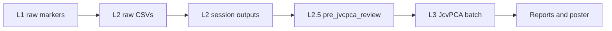

# Data Map — 3Layers JcvPCA Project

**Registry:** [`config/paths.yaml`](../config/paths.yaml)  
**Health check:** `python scripts/run_health_check.py`

---

## Pipeline flow

---

## Raw data (protected — do not move without migration plan)

| Stage | Physical path | Approx size | yaml key | Regeneratable |
|-------|---------------|-------------|----------|---------------|
| Layer 1 markers | `Layer1_motive_qc/motive_qc/data/` | part of ~1.4 GB L1 | `raw_data.layer1` | No |
| Layer 2 inputs | `Layer2_Motive_Kinematics/data/` | ~21 GB | `raw_data.layer2` | Partial |
| L2.5 descriptions | `Layer2.5_Segmentation/data_description/` | small | `raw_data.layer2_5_descriptions` | No |
| Test export | `671_test_data_des/` | ~232 MB | `raw_data.root_test_exports` | No |

---

## Processed / intermediate

| Stage | Physical path | Approx size | yaml key | Regeneratable |
|-------|---------------|-------------|----------|---------------|
| L2 session outputs | `Layer2_Motive_Kinematics/outputs/*_Take_*/` | ~32 GB | `layer2.active_session_glob` | Yes |
| L2 exports | `Layer2_Motive_Kinematics/outputs/layer2_exports/` | small | `layer2.layer2_exports` | Yes |
| L2 stage indices | `Layer2_Motive_Kinematics/outputs/stage*_index.*` | small | `layer2.stage_indices` | Yes |
| L2.5 JcvPCA exports | `Layer2.5_Segmentation/outputs/pre_jvcpca_review/` | ~1.2 GB | `layer2_5.pre_jvcpca_review` | Yes |
| L2.5 segmentation xlsx | `Layer2.5_Segmentation/segmentation/` | small | `layer2_5.segmentation_xlsx` | Manual |

**Index:** [`results/active/LAYER25_EXPORTS.md`](../results/active/LAYER25_EXPORTS.md)

---

## Layer 3 results

| Artifact | Physical path | Approx size | yaml key | Regeneratable |
|----------|---------------|-------------|----------|---------------|
| **Canonical batch** | `Layer3_JcvPCA/outputs/gaga_batch_jcvpca_20260626_193319/` | ~3.6 GB | `layer3.canonical_batch` | Yes (new timestamp) |
| Smoke batch | `Layer3_JcvPCA/outputs/gaga_batch_jcvpca_smoke_671_20260630_214341/` | ~370 MB | *(P3: external archive)* | Yes |
| Movement org report | `Layer3_JcvPCA/outputs/movement_organization_question_report/` | ~20 KB | *(P3)* | Yes |
| Nullspace review | `Layer3_JcvPCA/outputs/nullspace_link_stability_review/` | ~872 KB | *(P3)* | Yes |
| Poster evidence | `Layer3_JcvPCA/outputs/poster_ready_evidence_package/` | ~908 KB | `layer3.poster_evidence_package` | Yes |

**Never overwrite** canonical batch `193319`.

---

## Poster deliverables

| Artifact | Physical path | Approx size | yaml key |
|----------|---------------|-------------|----------|
| Final figures | `outputs/poster_final_figures/` | ~13 MB | `poster.final_figures` |

**Index:** [`results/poster/FIGURE_MANIFEST.md`](../results/poster/FIGURE_MANIFEST.md)

---

## External archives

| Archive | Path |
|---------|------|
| F2 cleanup | `../gaga_psylo_external_archive/final_cleanup_2026-06-30/` |
| L2 historical | `../gaga_psylo_external_archive/layer2_outputs_archive_2026-06-30/` |
| Stage B L3 | `../gaga_psylo_external_archive/archive_2026-06-30_cleanup_stage_B/` |

**Index:** [`results/archive_index/EXTERNAL_ARCHIVE.md`](../results/archive_index/EXTERNAL_ARCHIVE.md)

---

## Navigation hubs (P5 — active)

Unified browse paths at repo root (symlinks to legacy layer paths until P6):

| Hub | Resolves to |
|-----|-------------|
| `data/raw_layer1` | L1 raw markers |
| `data/raw_layer2` | L2 raw CSVs |
| `data/raw_layer2_5_descriptions` | L2.5 descriptions |
| `data/test_exports` | `671_test_data_des/` |
| `processed/layer2_outputs_root` | L2 outputs root |
| `processed/pre_jvcpca_review` | L2.5 JcvPCA exports |

yaml keys: `data.*`, `processed.*` (legacy `raw_data.*` / `layer2_5.pre_jvcpca_review` unchanged).

After Phase P6, hubs become **physical** paths with compat symlinks at legacy layer locations.

---

## Results index tree

Browse categorized deliverables under [`results/`](../results/) — see [`results/README.md`](../results/README.md).

---

*Updated Phase 2 P2 — sizes approximate as of 2026-06-30.*
