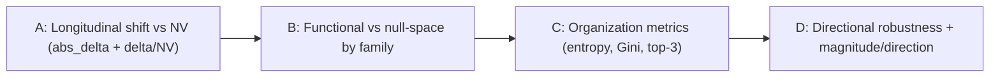

I have gathered everything needed. The project is mature: there is a dedicated `poster_ready_evidence_package/` whose aggregated tables already carry the exact columns your three models require, plus a primary batch (`gaga_batch_jcvpca_20260626_193319/`) with per-comparison raw `link_level_jrw_rss.csv` and directional-robustness summaries. Below is the full evaluation.

---

# 1. Short evaluation of project readiness

**Readiness: high. The current outputs are sufficient to build all four figures without any recomputation of JcvPCA** — only sorting, filtering, and plotting of existing tables is required.

**Most important files (the canonical, pre-aggregated layer):** `Layer3_JcvPCA/outputs/poster_ready_evidence_package/`

- `longitudinal_delta_nv_ratio_by_link.csv` and `longitudinal_delta_nv_ratio_top7.csv` — Model 1 (every column you named is present: `abs_longitudinal_delta`, `NV_*`, `delta_to_NV_*_ratio`, `outside_T1_NV_reference`).
- `concentration_metrics_all_analyses.csv` — Models 2 & organization metrics (`normalized_entropy`, `gini`, `top3_share`, `top5_share`, `links_needed_for_80_percent`, `analysis_type`, `focus_mode`, `concentration_label`).
- `body_region_anatomical_family_summary.csv` + `nullspace_top7_links_all_contexts.csv` — Model 3 (`functional_p50`/`null_space_after_p50` via `focus_mode`, `relative_family_share`, `functional_pc_count`, `nullspace_pc_count`).
- `direction_vs_magnitude_integrated_report.csv` + `directional_robustness_t1_t2_summary.csv` / `_t1_t3_` / `_t2_t3_` — the directional-robustness honesty layer (`sign_agreement_across_pairings`, `percent_sign_agreement_all_links`, `interpretation_label`).
- `natural_variability_timepoint_pattern_summary.csv` and `movement_organization_question_report/movement_organization_question_metrics.csv` — repetition/timepoint-state metrics.

**Raw per-comparison source (for axis→RSS provenance, supplement only):** `gaga_batch_jcvpca_20260626_193319/comparisons/{participant}_{block}_{Lx_Tx_vs_Ty}/run/link_level_jrw_rss.csv`.

**Validation checks still needed before plotting:**
- Confirm participant-ID typing is consistent (some files store `participant_id` as int `671`, others as string `'671'`); cast to string before grouping.
- Confirm `block_label` filtering uses exactly `P3_P4_P5` (primary) and `all_P1_P2_P3_P4_P5` (secondary).
- Verify the `delta_to_NV_T1_ratio` denominator is non-zero where ratios are very large (e.g. ratio ≈ 31 for `Chest_to_RShoulder` 671 / `RUArm_to_RFArm` 252) — these are real but driven by a tiny NV denominator and must be reported with the absolute NV value beside them, not as standalone "31×".
- Two files referenced in older planning docs are **missing** (`body_region_contribution_summary.csv`, `body_region_core_audit.csv`); the `body_region_anatomical_family_summary.csv` supersedes them, so no blocker.

---

# 2. The 4 recommended central figures

Reading order is designed as **A = what changed → B = where in the body → C = how organized → D = how trustworthy**.

---

## FIGURE A — Primary longitudinal link-level shift relative to natural variability (Model 1)

**Scientific question.** For each participant, which anatomical links show the largest change in JcvPCA contribution from baseline (T1) to T2 and T3, and which of those changes exceed the participant's own baseline repetition variability?

**Required data source.** `poster_ready_evidence_package/longitudinal_delta_nv_ratio_by_link.csv` (full link set) with `longitudinal_delta_nv_ratio_top7.csv` for labeling.

**Required columns.** `participant_id`, `block_label`, `comparison_label`, `link_id`, `anatomical_family`, `abs_longitudinal_delta`, `longitudinal_delta` (sign, secondary), `delta_to_NV_T1_ratio`, `NV_T1_abs_delta`, `outside_T1_NV_reference`, `rank_by_abs_longitudinal_delta`.

**Values plotted.** Filter `block_label == P3_P4_P5`. Four small panels: {671, 252} × {T1_vs_T2, T1_vs_T3}. Each panel = top 10 links by `abs_longitudinal_delta`, horizontal bars sorted descending. Bar length = `abs_longitudinal_delta`; bar fill encodes `delta_to_NV_T1_ratio` (sequential colormap); a filled marker/asterisk flags `outside_T1_NV_reference == True`; sign shown only as a small +/− glyph at the bar tip (de-emphasized).

Anchor values to expect (P3, all-PC): 671 T1_vs_T2 top = `RFArm_to_RHand` (~0.039), `RUArm_to_RFArm` (~0.023), `LThigh_to_LShin` (~0.023); 671 T1_vs_T3 = `RFArm_to_RHand` (~0.042), `LThigh_to_LShin` (~0.030), `LUArm_to_LFArm` (~0.018); 252 T1_vs_T3 = `RThigh_to_RShin` (~0.027), `RShin_to_RFoot` (~0.014), `LThigh_to_LShin` (~0.012).

**Links to highlight.** Arm/hand chain (`RFArm_to_RHand`, `LFArm_to_LHand`, `RUArm_to_RFArm`, `LUArm_to_LFArm`) and lower-limb (`LThigh_to_LShin`, `RThigh_to_RShin`); for 252 only, the pelvis-root links (`252_to_LThigh`, `252_to_RThigh`).

**Recommended visual format.** Paired horizontal lollipop/bar panels (2×2 grid), NV encoded by color + significance marker. Lollipop preferred over solid bars for a clean Nature-style look.

**Associated table.** "Top longitudinal link shifts vs natural variability." Rows = top 7 links per participant×comparison (from `longitudinal_delta_nv_ratio_top7.csv`). Columns = `link_id`, `anatomical_family`, `abs_longitudinal_delta`, `NV_T1_abs_delta`, `delta_to_NV_T1_ratio`, `outside_T1_NV_reference`. Each value: the magnitude of contribution change, the baseline repetition reference, their ratio, and whether the change is outside the descriptive NV band. The table quantifies the bars and lets readers see the NV denominator behind extreme ratios.

**Interpretation template.** "This figure shows link-level JcvPCA contribution changes on the P3–P5 block for each participant separately. The largest longitudinal shifts were observed in arm/hand and lower-limb links, and several of these exceeded the participant-specific descriptive natural-variability reference derived from T1 repetitions (e.g. 671 P3 T1_vs_T3: 14/14 links outside the NV reference). Confidence is greatest where a large `abs_delta` coincides with a high `delta_to_NV` ratio and the same anatomical family recurs across T2 and T3. These results describe blinded timepoint-related kinematic variation, not a treatment effect."

---

## FIGURE B — Functional vs null-space contribution by anatomical family (Model 3)

**Scientific question.** Which anatomical families carry the dominant, task-performing degrees of freedom (functional subspace, first ~50% of variance) versus the redundant/expressive degrees of freedom (null-space after p50)?

**Required data source.** `poster_ready_evidence_package/body_region_anatomical_family_summary.csv`; supporting link detail from `nullspace_top7_links_all_contexts.csv`.

**Required columns.** `participant_id`, `block_label`, `comparison_label`, `focus_mode` (use `functional_p50` and `null_space_after_p50`), `anatomical_family`, `relative_family_share`, `sum_abs_delta`, `n_links_in_family`, `family_rank`, `appears_in_p50`, `appears_in_p60`. From the link file: `functional_pc_count`, `nullspace_pc_count`, `JcvPCA_link_delta`, `abs_delta`, `is_top3`.

**Values plotted.** Filter `block_label == P3_P4_P5`, longitudinal `comparison_label` (T1_vs_T2 primary). For each participant, a grouped/diverging bar of `relative_family_share` by `anatomical_family`, with two bars per family: `functional_p50` vs `null_space_after_p50`. Families: `distal_upper_limb`, `proximal_upper_limb`, `shoulder_chain`, `lower_limb`, `trunk_neck_head`, and `pelvis_root` (252 only).

**Links/families to highlight.** Expect upper-limb/shoulder families to dominate the functional subspace; flag trunk/`pelvis_root`/lower-limb families that gain relative share in the null-space, since these are the Gaga-relevant expressive/redundant candidates. Family-level shares to expect: 252 lower_limb ≈ 0.35, proximal_upper_limb ≈ 0.30; 671 shoulder_chain ≈ 0.30, lower_limb ≈ 0.29.

**Recommended visual format.** Anatomical-family grouped bar plot (two panels, one per participant), functional vs null-space side-by-side, annotated with `functional_pc_count`/`nullspace_pc_count` (e.g. 671 P3: m=9, p50 split = 3 functional / 6 null PCs).

**Associated table.** "Functional vs null-space family contribution." Rows = anatomical family per participant. Columns = `relative_family_share_functional_p50`, `relative_family_share_null_space_after_p50`, `n_links_in_family`, `top_link_in_family`, `appears_in_p50`, `appears_in_p60` (threshold-stability flag). Each value = share of total absolute link contribution carried by that family within each subspace. Supports the figure by showing which families shift between subspaces and whether that membership survives the p60 threshold.

**Interpretation template.** "This figure separates link contributions into a functional subspace (PCs explaining the first ~50% of Dataset A variance) and a complementary null-space. Upper-limb and shoulder-chain families dominate the functional subspace, consistent with explicit task-performing links, while trunk/pelvis/lower-limb families carry a larger relative share of the null-space. The null-space should be read as redundant, expressive, or coordination-related degrees of freedom, not as unused movement. Subspace membership is variance-informed and shifts somewhat between the p50 and p60 thresholds, so it is reported as a sensitivity tier."

---

## FIGURE C — Movement-organization metrics across timepoints and repetitions (Model 2 + organization metrics)

**Scientific question.** Is link contribution broadly distributed or concentrated, and does within-session repetition variability and across-timepoint organization broaden or concentrate from T1 to T2/T3?

**Required data source.** `poster_ready_evidence_package/concentration_metrics_all_analyses.csv` (longitudinal + repetition rows) and `movement_organization_question_report/movement_organization_question_metrics.csv` (timepoint-state T1/T2/T3); `natural_variability_timepoint_pattern_summary.csv` for the repetition magnitude trend.

**Required columns.** From `concentration_metrics_all_analyses.csv`: `participant_id`, `block_label`, `analysis_type`, `comparison_label`, `focus_mode`, `normalized_entropy`, `gini`, `top3_share`, `top5_share`. From `movement_organization_question_metrics.csv`: `entropy_T1/T2/T3`, `gini_T1/T2/T3`, `top3_T1/T2/T3`. From `natural_variability_timepoint_pattern_summary.csv`: `T1/T2/T3_mean_abs_delta`, `largest_timepoint`, `monotonic_pattern`.

**Values plotted.** Two stacked sub-panels per participant on `P3_P4_P5`, `focus_mode == all`:
- (C1) Slope plot of `normalized_entropy` and `gini` across timepoint states T1→T2→T3 (one line each). Expected 671: entropy 0.952→0.963→0.888 (broadening at T2, drop at T3); 252 flat ≈ 0.92.
- (C2) Repetition variability: `mean_abs_delta` for T1_R1_vs_T1_R2, T2_R1_vs_T2_R2, T3_R1_vs_T3_R2 as grouped bars, annotated with `largest_timepoint` (671 → T2 peak ≈ 0.0156; 252 → T1 peak ≈ 0.0140).

**Recommended visual format.** Compact paired-panel: slope plot (C1) above grouped bar (C2), participants side-by-side. Optionally overlay top-3 share as a secondary axis dot.

**Associated table.** "Kinematic organization summary." Rows = participant × {timepoint-state T1/T2/T3} and × {repetition pair}. Columns = `normalized_entropy`, `gini`, `top3_share`, `mean_abs_delta`, `largest_timepoint`, `monotonic_pattern`. Each value: how evenly contribution is spread (higher entropy / lower Gini / lower top-3 share = more distributed) and how large within-session repetition differences are.

**Interpretation template.** "This figure summarizes how distributed link contributions are. Across longitudinal comparisons, contributions were broadly to moderately distributed (median normalized entropy ≈ 0.91; Gini ≈ 0.35–0.55 on P3). Participant 671 showed a more distributed organization at T2 (greater within-session differentiation) followed by a more concentrated pattern at T3, whereas participant 252 showed no clear directional trend. Higher repetition variability is described as a broader distribution of link-level changes, not as improved or better movement."

---

## FIGURE D — Directional robustness and magnitude–direction separation (honesty / caution figure)

**Scientific question.** Are the *directions* (signs) of pooled link-level deltas preserved across repetition-specific pairings, and which links combine large magnitude with unstable direction?

**Required data source.** `poster_ready_evidence_package/direction_vs_magnitude_integrated_report.csv` and the three `gaga_batch_jcvpca_20260626_193319/directional_robustness_t1_t2_summary.csv` / `_t1_t3_summary.csv` / `_t2_t3_summary.csv`.

**Required columns.** Summary files: `participant_id`, `block_label`, `comparison_variant`, `focus_mode`, `percent_sign_agreement_all_links`, `percent_sign_agreement_top5_pooled_links`, `spearman_rho_delta`. Integrated report: `link_id`, `anatomical_family`, `mean_abs_delta_across_pairings`, `sign_agreement_across_pairings`, `rank_stability_score`, `interpretation_label` (`stable_magnitude_stable_direction`, `stable_magnitude_direction_sensitive`, `low_magnitude_stable_direction`, `unstable_both`).

**Values plotted.**
- (D1) Heatmap: rows = participant × block × comparison (T1_vs_T2, T1_vs_T3; T2_vs_T3 supplement), columns = `focus_mode` (all, functional_p50, null_space_after_p50, null_space_after_p60), fill = `percent_sign_agreement_all_links`. Expected: all-PC ≈ 53–63% median; functional_p50 higher (≈ 70–75%).
- (D2) Quadrant scatter for P3 T1_vs_T2: x = `mean_abs_delta_across_pairings`, y = `sign_agreement_across_pairings`, points colored by `interpretation_label`, labeling links in the high-magnitude/low-agreement quadrant (e.g. flag links matching `stable_magnitude_direction_sensitive`).

**Recommended visual format.** Compact matrix heatmap (D1) + labeled quadrant dot plot (D2). Add a 50% reference line on the agreement axis.

**Associated table.** "Directional robustness by comparison and focus mode." Rows = comparison × block × participant. Columns = `percent_sign_agreement_all_links`, `percent_sign_agreement_top5_pooled_links`, `spearman_rho_delta` per focus mode. Each value: the percent of links whose pooled sign matches repetition-specific pairings (100% = perfectly preserved; ~50% = mixed).

**Interpretation template.** "This figure reports the stability of the *direction* of link-level change. Median sign agreement between pooled and repetition-specific contrasts was approximately 53–63% for all-PC longitudinal comparisons, indicating that pooled link signs are useful aggregate descriptions but are not uniformly preserved at the link level. The variance-informed functional_p50 subspace generally showed higher sign agreement. Accordingly, `abs_delta` (magnitude) is treated as the robust quantity; signed direction is reported only as secondary context, and links in the high-magnitude/low-agreement quadrant are explicitly flagged as direction-sensitive."

---

# 3. Recommended final figure panel

A single landscape poster panel, read **A → B → C → D**:

- **Panel A (top-left, largest):** primary result — what changed and whether it exceeds NV.
- **Panel B (top-right):** anatomical interpretation — functional vs null-space families.
- **Panel C (bottom-left):** organization metrics — how distributed, across timepoints/repetitions.
- **Panel D (bottom-right):** robustness/caution — direction stability and magnitude–direction separation.

Logical narrative: *A establishes that measurable, NV-exceeding link-level shifts occurred (per participant); B locates them anatomically and separates task-performing from redundant/expressive degrees of freedom; C characterizes whether organization broadened or concentrated; D constrains how strongly any directional claim can be made.* Keep 671 and 252 as separate sub-panels throughout — never share an axis that implies pooling.



---

# 4. Warnings and limitations

- **Participant pooling:** Never average, normalize, or share axes across 671 and 252. Always label `participant_id`. Every figure uses separate panels.
- **Skeleton differences:** 671 has 14 links; 252 has 16 links and a unique `pelvis_root` family (`252_to_LThigh`, `252_to_RThigh`) absent in 671. Do not compare bar heights across participants.
- **Natural-variability threshold:** NV is a *descriptive* T1-repetition reference, not a statistical test. `outside_T1_NV_reference` means "outside a repetition band," not "significant." Very large `delta_to_NV` ratios (≈30×) are driven by tiny NV denominators — always show `NV_T1_abs_delta` alongside.
- **Signed-delta instability:** Direction sign-agreement is ~53–63% (all-PC). Prioritize `abs_delta`; report sign only as secondary context; flag sign-flipping links explicitly.
- **Blinded interpretation:** Describe everything as blinded timepoint-related kinematic variation.
- **No clinical/treatment claims:** No psilocybin, treatment-effect, improvement, or causal language. Avoid metaphorical phrasing ("more democratic/expressive movement") in the figure captions.
- **PC-focus is a sensitivity tier:** all-PC leads; functional_p50 / null_space_after_p50 are sensitivity; p60 optional; archived p2 excluded.

---

# 5. Concrete implementation checklist

**Files to inspect first (in order):**
1. `poster_ready_evidence_package/longitudinal_delta_nv_ratio_by_link.csv` (Figure A)
2. `poster_ready_evidence_package/body_region_anatomical_family_summary.csv` + `nullspace_top7_links_all_contexts.csv` (Figure B)
3. `poster_ready_evidence_package/concentration_metrics_all_analyses.csv` + `movement_organization_question_report/movement_organization_question_metrics.csv` + `natural_variability_timepoint_pattern_summary.csv` (Figure C)
4. `poster_ready_evidence_package/direction_vs_magnitude_integrated_report.csv` + `gaga_batch_jcvpca_20260626_193319/directional_robustness_t1_t2_summary.csv` / `_t1_t3_` / `_t2_t3_` (Figure D)

**Values to validate before plotting:**
- `participant_id` dtype consistency (cast to string); filter `block_label == 'P3_P4_P5'`.
- Recompute/verify `delta_to_NV_T1_ratio = abs_longitudinal_delta / NV_T1_abs_delta` and confirm extreme ratios have non-degenerate denominators.
- Confirm `focus_mode` values are exactly `all`, `functional_p50`, `null_space_after_p50`, `null_space_after_p60`.
- Sanity-check `relative_family_share` sums to ~1 within each participant×focus_mode×comparison.
- Confirm `percent_sign_agreement_all_links` is on a 0–100 scale, not 0–1.

**CSV tables to export (one per figure, filtered to P3_P4_P5):**
- `figA_top_links_nv_ratio.csv` (top-7 links × participant × {T1_vs_T2, T1_vs_T3})
- `figB_family_functional_vs_nullspace.csv`
- `figC_organization_metrics.csv`
- `figD_directional_robustness.csv`

**Image exports:** For each figure export `.svg` + `.pdf` (vector, print) and `.png` (300 dpi preview). Combine into one `poster_panel_ABCD.pdf`.

**Suggested output directory structure:**

```
Layer3_JcvPCA/outputs/poster_figures/
  data/
    figA_top_links_nv_ratio.csv
    figB_family_functional_vs_nullspace.csv
    figC_organization_metrics.csv
    figD_directional_robustness.csv
  figures/
    figA_longitudinal_nv/{671,252}_{T1_vs_T2,T1_vs_T3}.{svg,pdf,png}
    figB_functional_nullspace/{671,252}.{svg,pdf,png}
    figC_organization/{671,252}.{svg,pdf,png}
    figD_robustness/{heatmap,quadrant}.{svg,pdf,png}
    poster_panel_ABCD.pdf
  captions/figure_captions.md
```

---

This is an evaluation/recommendation deliverable (no code or files created, per plan mode). If you'd like, I can switch to implementation mode and generate the four figures + the four export CSVs directly from the `poster_ready_evidence_package` tables — just confirm and tell me whether to target both participants and both comparisons (T1_vs_T2 and T1_vs_T3) for Figure A.