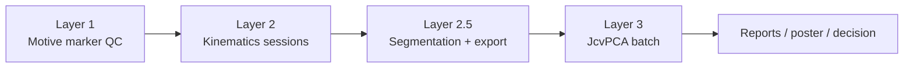
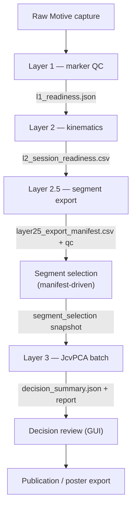
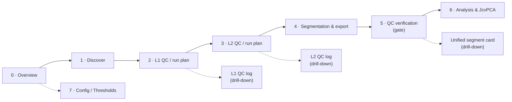
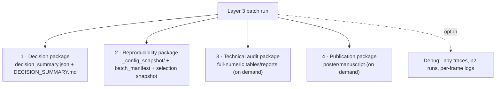
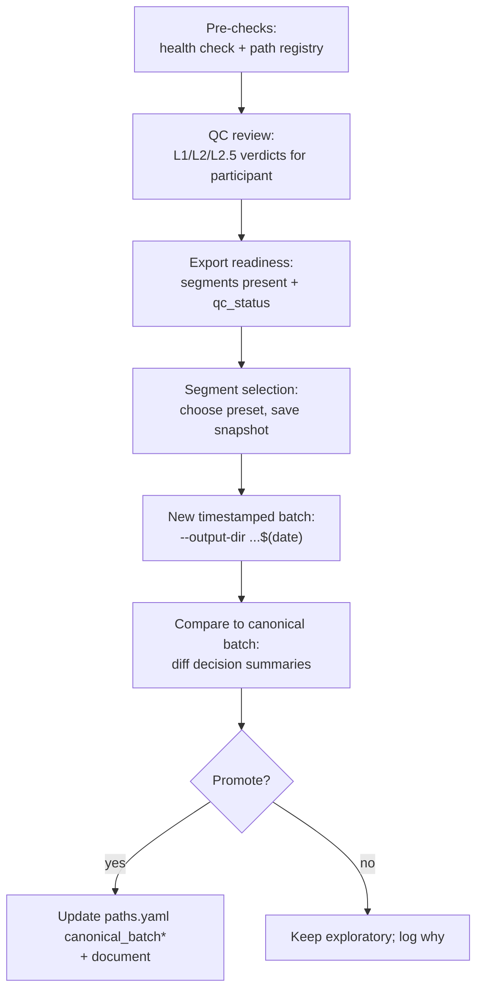
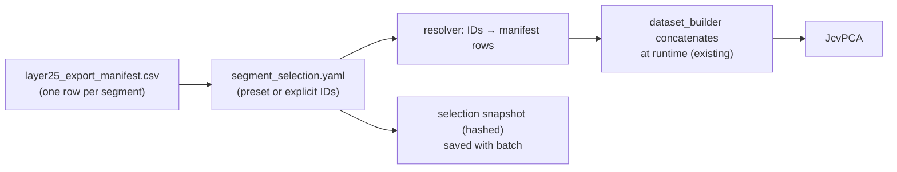
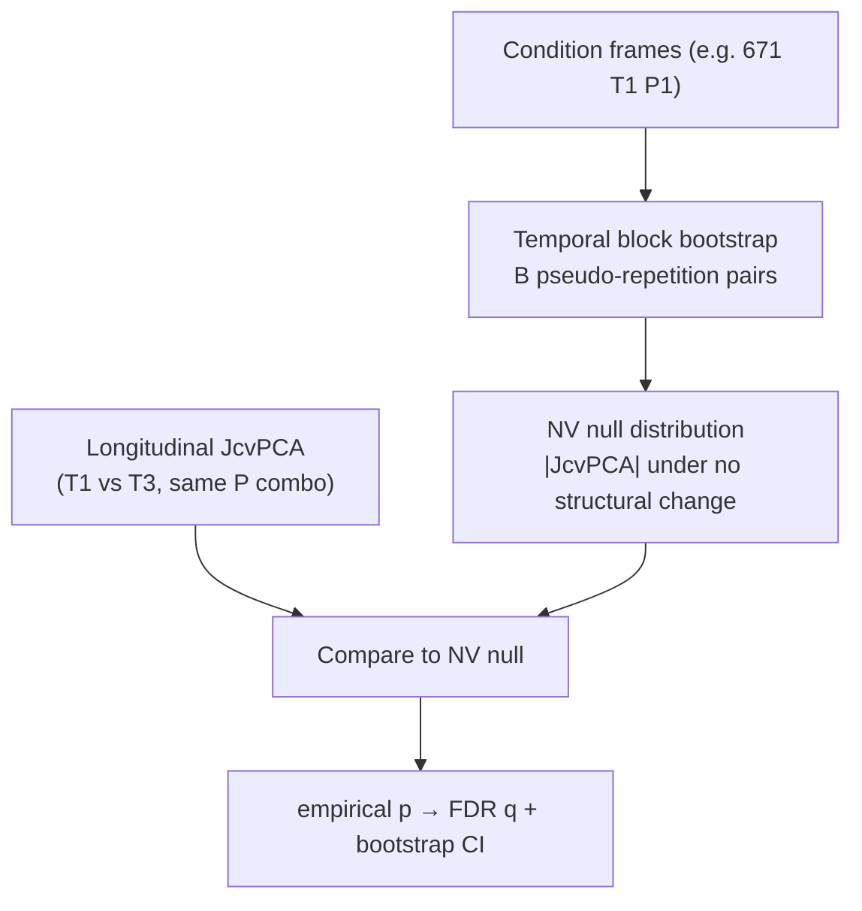

# Program & GUI Optimization Plan — 3Layers JcvPCA

**Date:** 2026-07-01 (amended 2026-07-01 — integrated 8-stage workflow, explanation-first verdicts, G6 execution boundary; updated 2026-07-01 — G6/runner/link_focus stabilization status)
**Mode:** Planning only. No code edits, no file moves, no deletions, no analysis runs, no config changes. This document is the sole artifact.
**Author role:** Senior research-software architect review.
**Scope:** Whole-program optimization for the *next-participant* analysis cycle (252 and beyond), with emphasis on the GUI as a research workflow assistant, config-driven QC, output consolidation, and modular segment selection.

**Grounding docs:** [`RUN.md`](../../RUN.md) · [`README_WORKING.md`](../../README_WORKING.md) · [`docs/DATA_MAP.md`](../DATA_MAP.md) · [`config/paths.yaml`](../../config/paths.yaml) · [`src/project_paths.py`](../../src/project_paths.py) · [`Layer3_JcvPCA/docs/LAYER3_SCOPE.md`](../../Layer3_JcvPCA/docs/LAYER3_SCOPE.md) · [`PHASE2_FULL_IMPLEMENTATION_PLAN.md`](PHASE2_FULL_IMPLEMENTATION_PLAN.md) · [`M12_PRE_ANALYSIS_READINESS.md`](M12_PRE_ANALYSIS_READINESS.md)

**Relationship to prior plans:** The Phase 2 plan (P1–P6) delivered *folder/runner hygiene*: `RUN.md`, root wrappers in [`scripts/`](../../scripts/), the `config/paths.yaml` registry, `data/`+`processed/` hubs, and `results/` indexes. That work is assumed complete. **This plan does not repeat cleanup.** It targets the *workflow architecture*: how a researcher moves from raw capture to a defensible scientific decision with minimal manual bookkeeping and maximal transparency.

---

## 0. What the program is today (baseline)

A four-stage pipeline over Gaga/Motive movement capture for participants **671** and **252**:



Key mechanics discovered in review:

- **Segments already exist independently.** Layer 2.5 exports one parquet matrix per exercise window, indexed in a **central manifest** `layer25_export_manifest.csv`. **Segmentation xlsx workbooks** (`Layer2.5_Segmentation/segmentation/{participant}_ex_segmentatios_frames.xlsx`) are the **source of truth for all exercise rows** (`ex01`, `ex02`, … through the final row). Gaga labels (`P1`–`P5`, Motive `exercise_id` 9–13) are mappings on some rows, not the full catalog. Default exports historically emphasized P1–P5 + `combined_group4`; the target workflow exports and reviews **every xlsx row** unless explicitly filtered. Source: [`exercise_segments.py`](../../Layer2.5_Segmentation/src/pre_jvcpca_review/exercise_segments.py), `layer3_export_manifest.py`, `gaga_batch_export.py`.
- **Layer 3 already concatenates selected manifest rows at runtime** via `dataset_builder.py` and `comparable_links.py` — it does *not* need pre-combined CSVs. This is the foundation for modular segment selection (Section 12).
- **Parameters are mostly hardcoded in Python**, not config: `variance_threshold=0.80`, `SENSITIVITY_P=2`, participant list `("671","252")`, block definitions, p50/p60 thresholds — all in `Layer3_JcvPCA/src/layer3_jcvpca/gaga_batch_runner.py` and siblings. The only YAML config in Layer 3 (`config/layer3_config.yaml`) is for the unused V1 manifest runner and even disagrees (0.90 vs 0.80).
- **The GUI is three Streamlit surfaces** with fragmented path resolution and no caching: `Dashboard/pre_jvcpca_dashboard.py` (965 lines, 5 tabs), `Dashboard/pages/1_Layer3_JcvPCA_Analysis.py` (285), `Dashboard/pages/2_Layer3_Gaga_Workbench.py` (1923 lines, monolithic, "phases 0–18"). It is a *builder/plotter*, not a *status/decision* tool.
- **Layer 3 output is enormous:** the canonical batch `gaga_batch_jcvpca_20260626_193319` holds ~9,900 files (72 comparison dirs, ~268 PNGs, ~82 batch-root aggregates, 14 markdown reports, plus sidecar packages). Most are audit/debug detail, not decision surface.
- **QC status is opaque:** every one of the 72 exports is `qc_status=warning` and `layer3_safe=true`. "Warning" has lost meaning — it neither blocks nor informs a decision.

The program *works and is reproducible*. The problem is **cognitive load and decision friction**, not correctness.

---

## 1. Current pain points

### 1.1 Redundant / excessive outputs
- **~9,900 files per Layer 3 batch.** A researcher cannot answer "did coordination change T1→T3?" without opening a dozen files. The signal-to-file ratio is very low.
- **Duplicated derived summaries.** Poster evidence package, movement-organization report, and nullspace review each re-derive from the same batch CSVs (`jcvpca_link_results.csv`, evenness tables). Three narratives, one source.
- **p2 sensitivity runs archived but retained** (`*_archived_p2.csv`, `run_functional_p2/`) alongside the promoted p50/p60 runs — audit value only, but sitting in the primary tree.
- **Orphan / legacy export dirs.** Pre-Gaga review-only folders like `671_T1_P1_R1_s14280_e15240/` (no matrix, not in manifest) coexist with canonical exports; Layer 3 inventory has to actively detect and skip them (`_find_orphan_matrices`).
- **Mirror trees.** `Layer2.5_Segmentation/outputs/pre_jvcpca_review` and `processed/pre_jvcpca_review` both exist on disk (P6 migration + compat), doubling the browse surface.

### 1.2 Unclear decision points
- After each layer there is **no explicit "ready / not ready / why" signal**. `README_WORKING.md` has a manual "What to run next" table maintained by hand; nothing is derived from the data.
- **QC warnings are undifferentiated.** 34/36 of 252's rows are `warning`; the researcher has no ranked view of *which* warnings matter (`window.stage08_masked` strong-warning vs `window.layer1_evidence_overlap` info).
- **No coverage gate before Layer 3.** Nothing tells you "252 has all 6 sessions × 6 exports; comparison L2_T1_vs_T3 is constructible" before you run a multi-hour batch.

### 1.3 Scattered parameters
- Thresholds live in ≥5 Python modules with no single source of truth, and the one YAML that exists is stale/unused. Changing the PCA variance threshold means editing code, which invalidates the "config generated this result" story.

### 1.4 Hard-to-use GUI
- **Three disconnected surfaces**, three path-resolution strategies (hardcoded L1/L2 roots in Pre-JcvPCA; hardcoded `DEFAULT_PATHS` in the analysis controller; `paths.yaml` only in the workbench inventory).
- **1923-line monolith** (Gaga Workbench) mixing inventory, export, dataset construction, preflight, and an 18-step pipeline runner in one scroll.
- **No caching** (`@st.cache_data`/`@st.cache_resource` unused) → inventory scans and diagnostics recompute on every rerun.
- **The GUI never reads finished Layer 3 batch results.** It can build/run analysis but cannot show "here are the results of the canonical batch." It is write-only with respect to the science.
- **The GUI cannot see participants/coverage at a glance.** There is no "project overview" answering "who exists, what passed QC, what is ready."

### 1.5 Debug-vs-daily confusion
- Full numeric reports (2000–2500 line markdown), per-run `.npy`/`.json` traces, and 268 PNGs are indispensable for audit but are surfaced at the same level as the one summary a researcher actually needs daily.

---

## 2. Desired end-to-end workflow

Design principle: **each layer emits a machine-readable "readiness verdict"** (`pass` / `warning` / `blocked`, with reasons) that the next layer and the GUI consume. Verdicts are derived, never hand-maintained.



| Step | Input | Output | QC decision | GUI shows | Automate | Manual approval | Save for reproducibility |
|------|-------|--------|-------------|-----------|----------|-----------------|--------------------------|
| **L1 QC** | Raw markers | Per-run QC + `l1_readiness` verdict | gaps/artifacts/swaps vs thresholds → pass/warn/block | Per-session pass/warn/block with top reasons | Threshold checks, verdict derivation | Overriding a `block` to proceed | QC metrics + threshold snapshot |
| **L2 kinematics** | L1-approved sessions | Session outputs + `l2_session_readiness` | frame coverage, stage07/08 eligibility | Session table: eligible frames %, flags | Session discovery + eligibility scan | Accepting a low-eligibility session | Stage indices + eligibility fractions |
| **L2.5 export** | L2 sessions + segmentation xlsx | Per-segment matrices + central manifest w/ `qc_status`, `layer3_safe` | blocking warnings stop export; strong-warnings flagged | Segment grid per participant: **all xlsx exercises** (`ex01`…), qc_status, frame ranges, export status | Batch export of selected xlsx rows (+ optional combined) | Exporting a segment with strong warnings | Central manifest + per-window manifest + feature_schema_id |
| **QC verification gate** | Central manifest + L1/L2/L2.5 evidence | Verified segment set + reviewer sign-off log | blocking issues must be resolved or explicitly overridden | Stage 5 verification summary; per-segment explanation cards | Comparability + severity ranking | Sign-off before Layer 3 unlock | `verification_snapshot.yaml` (hashed) |
| **Segment selection** | Verified manifest rows | `segment_selection.yaml` snapshot | comparability across selected segments | Segment picker w/ presets + comparability warnings | Preset resolution, comparability check | Confirming a cross-participant/timepoint mix | Frozen selection file (hash) |
| **L3 JcvPCA** | Selected segments + params config | Batch dir + `decision_summary.json` | coverage sufficiency, PCA stability gate | One decision summary + drill-down | Batch run, aggregation, verdict | Promoting to canonical | Config snapshot + selection snapshot + manifest |
| **Decision review** | `decision_summary.json` | Reviewed verdict, notes | which comparisons are decision-relevant | Ranked comparisons w/ effect + uncertainty | Ranking, flagging inconclusive | Sign-off on interpretation | Reviewer notes + override log |
| **Publication** | Approved batch | Poster/manuscript package | figure selection | Export panel | Figure/data package generation on demand | Final figure selection | Figure ↔ source-data index |

**Non-negotiable from `LAYER3_SCOPE.md`:** conservative language (no "significant"/"proved"), manual B-projection, RSS link aggregation, no z-scoring. The workflow must *surface uncertainty* (NV/repetition-level variability) next to every effect, never hide it.

---

## 3. GUI redesign — integrated workflow assistant

**Core inversion:** show *decision-relevant status first*, with **full evidence for every verdict**; hide *raw debug logs* behind drill-downs and expanders. The GUI follows one integrated pipeline — **discover → run L1 → run L2 → segment (all xlsx exercises) → verify QC → analyze** — not a collection of disconnected tools.

**Verdict principle (mandatory):** the GUI is **explanation-first, not label-first**. Short categories (`Ready`, `Usable with caution`, `Not recommended`, `Blocked`, `Missing / insufficient data`) are **headlines only**. Every verdict must ship with plain-language reasoning, a structured evidence table, interpretation consequence, and action recommendation (Section 3.4).

**Roadmap boundary (mandatory):**

| Phase | GUI may do | GUI must not do |
|-------|------------|-----------------|
| **G1–G5** | Read-only inventory, dry-run plans, explanation cards, verification *review* UI | Run buttons that execute L1/L2/L2.5/L3; config/threshold writes; output modification |
| **G6** | Guarded run triggers (subprocess to `scripts/run_*.py`); validated threshold edits; run audit logs | Target canonical batch; silent writes |
| **G7+** | Full L1/L2 log drill-downs; unified segment card; legacy workbench consolidation | Promote logs to primary daily navigation |

**Interim note:** `Dashboard/pages/6_Session_Discovery.py` (G6 preview) is a **temporary bridge** combining Stages 1–3 (+ partial L2.5) until pages are split and G6 guards are finalized. It must not be treated as the final navigation model.

### 3.1 Final navigation model — eight stages

**Primary navigation principle (confirmed):** The sidebar follows **Stages 0–7** in pipeline order. Each stage answers one question. **Stage 5 is the explicit verification gate** — Layer 3 analysis intent (Stage 6) stays locked until the user reviews and signs off verified segments.

```text
Stage 0 · Project Overview
→ Stage 1 · Discover & Data Inventory
→ Stage 2 · Layer 1 QC / Run Planning
→ Stage 3 · Layer 2 QC / Run Planning
→ Stage 4 · Segmentation & Export Review
→ Stage 5 · Segment / Link / Frame QC Verification   ← gate before Layer 3
→ Stage 6 · Analysis Intent, Execution Plan, and JcvPCA
→ Stage 7 · Config / Thresholds
```



#### Stage-gate matrix (what each page shows and what is allowed)

Each stage must surface five inventory fields on load: **what exists**, **what is missing**, **what is ready**, **what is risky**, **what is blocked** — each backed by Section 3.4 evidence, not a lone label.

| Stage | Primary question | What exists (derived) | What is missing | Ready | Risky | Blocked | **Allowed G1–G5** | **Allowed G6+** |
|-------|------------------|----------------------|-----------------|-------|-------|---------|-------------------|-----------------|
| **0 · Project Overview** | Where am I in the pipeline? | Participants, session counts, canonical batch pointer, per-layer progress % | Unindexed sessions, absent layers, stale index | Sessions with L1+L2+L2.5 export + verification | Sessions with strong warnings or partial coverage | Sessions with blocking QC or no raw data | View only; next-action recommendation (text) | Same + link to run stage |
| **1 · Discover & Data Inventory** | What L1/L2 data is on disk? | `session_index.csv` rows: paths, frame counts, match warnings | `missing_layer1_output`, unmatched L2, stale index | Matched L1+L2 pairs | Multiple run candidates, frame mismatch | No discoverable sessions | Scan/index repair **read-only**; show discovery table | Re-discover after runs; optional index write via guarded repair |
| **2 · Layer 1 QC / Run Planning** | Which sessions need L1 QC? | L1 run dirs, qc_mask presence, L1 verdicts per session | L1 output absent for session | L1 pass / acceptable warn | Gap/artifact tiers above caution | L1 block flags | **Dry-run L1 command plan**; run-readiness summary; **→ L1 log drill-down** | Execute L1 for selected sessions; post-run summary + per-session drill-down |
| **3 · Layer 2 QC / Run Planning** | Which sessions need L2 kinematics? | L2 export dirs, stage07/08 status, eligibility % | L2 output or raw CSV absent | Stage07 pass + stage08 authorized | Jump warnings, review_required | Stage07 fail / stage08 blocked | **Dry-run L2 command plan**; session summary; **→ L2 log drill-down** | Execute L2 for selected sessions; post-run summary + per-session drill-down |
| **4 · Segmentation & Export Review** | Which **xlsx exercises** are exported? | All rows from segmentation sheet per session: `ex01`…end, frame ranges, manifest coverage | xlsx row without matrix; manifest without xlsx row | Exported segment, `layer3_safe=true`, qc pass | Exported with QC warning / strong warning | `layer3_safe=false` or export blocked | Coverage grid xlsx ↔ manifest; export **plan preview** only | Run L2.5 export for selected sessions/exercises |
| **5 · QC Verification** *(gate)* | Are chosen segments safe for Layer 3? | Per-segment + per-link + per-frame QC evidence; comparability | Unverified segments; schema mismatch | Verified + signed-off segments | Caution segments (local issues, still `layer3_safe`) | Blocked segments / unsafe links | Review all evidence; build verification checklist; **no L3 unlock** | Record sign-off snapshot; unlock Stage 6 for verified set |
| **6 · Analysis & JcvPCA** | What to analyze and what ran? | `analysis_request.yaml`, dry-run plan, canonical/new batch results | Incomplete selection, failed comparability | Constructible comparison + verified segments | Partial coverage / NV-band inconclusive | Schema mismatch / blocked segments in request | Request builder, G5 dry-run plan, read canonical batch | Timestamped L3 batch run; decision summary |
| **7 · Config / Thresholds** | What rules produced these verdicts? | Registry values, defaults, scientific meaning, config hash vs canonical | Unregistered thresholds | Config matches canonical snapshot | Config differs from canonical (banner) | Out-of-range invalid config | **Read-only** view + invalidation graph preview | Edit `gui_editable` fields + audit log |

#### Stage content layout (every stage)

| Layer | Content |
|-------|---------|
| **Top** | Stage summary strip: exists / missing / ready / risky / blocked counts + primary next action |
| **Middle** | Selection + main table/matrix with **VerdictCard** per row (Section 3.4) |
| **Bottom** | Dry-run plan or run summary (Stages 2–6); expanders for technical detail |
| **Linked (not primary)** | L1/L2 full logs, unified segment card, raw CSVs, plots |

#### Mapping from current pages → target stages *(transitional)*

| Target stage | Current / interim Streamlit page | Notes |
|--------------|----------------------------------|-------|
| 0 | `0_Project_Overview.py` | Extend with stage progress |
| 1 | `6_Session_Discovery.py` (discover half) | Split discover from run controls |
| 2 | `6_Session_Discovery.py` (L1 half) | Dry-run only until G6 |
| 3 | `6_Session_Discovery.py` (L2 half) | Dry-run only until G6 |
| 4 | `2_Segmentation_Coverage.py` | Default to **all xlsx exercises** |
| 5 | `1_Data_Readiness.py` + `3_Joint_Link_QC.py` | Merge into verification gate + sign-off |
| 6 | `4_Analysis_Request_Builder.py` + `5_Execution_Plan.py` + legacy L3 pages | Lock until Stage 5 sign-off |
| 7 | `7_Config_Thresholds.py` | Read-only through G5 |

### 3.2 Cross-cutting GUI rules
- **Single path source.** All surfaces load via `src/project_paths.py` (`load_project_paths()`), removing hardcoded roots in layer controllers and `session_index.py`.
- **Segmentation xlsx is source of truth.** Stage 4 and all export/coverage logic default to **all exercise rows** in `{participant}_ex_segmentatios_frames.xlsx`. Gaga P1–P5 presets are filters, not the catalog ceiling.
- **Explanation-first verdicts (Section 3.4).** No status cell, badge, or recommendation may render a category without the five-part VerdictCard. Labels alone are insufficient for daily use.
- **Stage 5 gates Stage 6.** Stage 6 analysis intent and JcvPCA run controls remain disabled until Stage 5 verification sign-off (or explicit logged override in G6+).
- **Read finished results.** Stage 6 must read the canonical batch (`layer3.canonical_batch`) and any new timestamped batch.
- **Decision-first, debug-hidden.** Full L1/L2 logs are drill-downs or expanders — **not primary daily views** and not top-level sidebar tabs.
- **Cache expensive scans.** Wrap inventory/manifest/QC reads in `@st.cache_data` keyed on file mtime + selection signature.
- **Never write silently.** Any G6+ action shows exactly what path it writes and never targets the canonical batch.
- **G1–G5 hard stop.** Stages 0–6 and Stage 7 are **read-only for execution and config writes**: no run buttons, no threshold editing, no output modification. Stages 2–3 may show **run-readiness** and **dry-run command plans** only. Actual L1/L2 execution waits for **G6 guarded triggers** (Section 4.8).

### 3.3 QC log drill-downs and unified segment card *(future enrichment)*

These are **optional audit/transparency views** — not primary navigation. They answer: *show me the underlying evidence behind this readiness cell / link recommendation / segment verdict.*

**Placement in roadmap:** implement after core stage pages are stable (G2–G5). Recommended sequencing:

| Deliverable | Suggested phase | Entry stage |
|-------------|-----------------|-------------|
| **L1 QC Log drill-down** | G7 (or G2+ slice) | Stage 2 |
| **L2 QC / Kinematics Log drill-down** | G7 (or G3+ slice) | Stage 3 |
| **Unified segment card** | G7 | Stage 5 |

All three remain **read-only** until G6 unless explicitly part of a post-run review in G6.

#### 3.3.1 L1 QC Log drill-down

**Entry points:** Stage 2 — link from any session row or VerdictCard; optional expander on Stage 0.

**Purpose:** Full Layer 1 evidence behind the unified readiness matrix.

**Filters (all optional, combinable):** participant, timepoint, repetition, session / task part, **exercise label (`ex01`… or Gaga P-phase where mapped)**, QC status, missingness tier, gap tier, readiness outcome.

**Row content (indicative):** session/run key, frame/time span, missing-data %, gap flags, artifact/swap flags, segment-length change, derived L1 verdict, threshold keys cited, pointer to source files (`qc_mask.csv`, `artifact_events.csv`, etc.).

**Back-links:** each row links to the **Stage 2 session VerdictCard** (and forward to unified segment card when segment mapping exists).

#### 3.3.2 L2 QC / Kinematics Log drill-down

**Entry points:** Stage 3 and Stage 5; secondary link from segment rows on Stage 4.

**Purpose:** Link-level and session-level Layer 2 computation/QC evidence — the raw material behind link recommendations and export blocking.

**Filters:** participant, timepoint, repetition, link / link stem, body region, P-phase / export segment, jump warning vs fail, stage07/08 masking status, quaternion/rotvec integrity flags, `layer3_safe`-relevant eligibility, QC severity.

**Row content (indicative):** session, link_id, parent/child, frame counts, jump magnitude/status, mask reason, analysis eligibility, rotvec scope, pointers to `layer2_session_link_manifest.csv`, integrity audit, parquet columns as needed.

**Connections:** navigation to **Stage 5** link recommendations and unified segment card.

#### 3.3.3 Unified segment card

**Entry points:** Stage 4 (segment grid), Stage 5 (verification), Stage 6 (resolved segment in analysis request).

**Purpose:** One consolidated **VerdictCard** view of **L1 + L2 + L2.5** evidence for a single export segment (e.g. `671_T1_P1_R1::ex03` or `::P1`).

**Must show (decision-first layout — all five VerdictCard parts, Section 3.4):**

1. **Verdict headline** — ready / caution / not recommended / blocked / missing.
2. **Plain-language explanation** — why, with affected %, scope (whole segment vs links/regions), issue type (gaps, jumps, masking, schema, etc.).
3. **Evidence table** — frames, links, body regions, QC source file, threshold key, threshold value, observed value, blocking vs advisory.
4. **Interpretation consequence** — what it means for whole-body vs link-level JcvPCA claims.
5. **Action recommendation** — include / include with caution / exclude / re-export / manual review.

Plus metadata: `layer3_safe`, `qc_status`, `n_frames`, `feature_schema_id`, xlsx frame range (`exercise_id`, sheet row), comparability for requested comparisons.

**Non-goals:** the segment card is a **detail panel**, not a replacement for Stages 0–6. It deep-links to L1/L2 log drill-downs for full audit tables.

### 3.4 Explanation-first verdict model *(implementation contract)*

Short verdict labels are **summaries only**. The GUI and all recommendation modules must produce a structured **VerdictCard** for every flag, cell, link row, and segment row.

#### 3.4.1 Five required parts (every verdict)

| # | Field | Purpose | Example |
|---|-------|---------|---------|
| 1 | **`headline`** | Short category | `Usable with caution` |
| 2 | **`explanation`** | Plain-language why | "Segment remains `layer3_safe=true`, but 10% of frames have short marker gaps (<0.5 s), concentrated in right-arm links." |
| 3 | **`evidence[]`** | Structured facts | See evidence schema below |
| 4 | **`consequence`** | Scientific meaning for Layer 3 | "Whole-body JcvPCA may proceed; down-weight right-arm link-specific claims." |
| 5 | **`action`** | What the researcher should do | "Include in accumulated analysis with caution; avoid strong right-arm-specific statements." |

**Forbidden:** rendering only `pass`, `warn`, `missing`, `ready`, `caution`, `blocked`, or a colored pill with no explanation block.

#### 3.4.2 Evidence row schema (each item in `evidence[]`)

| Field | Required | Description |
|-------|----------|-------------|
| `issue_type` | Yes | e.g. `missing_markers`, `short_gap`, `long_gap`, `jump_artifact`, `stage08_mask`, `rotvec_warning`, `quaternion_issue`, `segmentation_mismatch`, `feature_schema_mismatch`, `unsafe_link`, `missing_export` |
| `affected_fraction` | When applicable | 0.0–1.0 or % of segment/session/link |
| `affected_frame_count` | When applicable | Integer frame count |
| `gap_duration_s` | When applicable | For gap-class issues |
| `affected_links` | When applicable | Link IDs or stems |
| `affected_body_regions` | When applicable | e.g. `upper_body`, `right_arm` |
| `affected_sessions` / `repetitions` / `p_phases` | When applicable | Scope identifiers |
| `scope` | Yes | `whole_segment` \| `link_subset` \| `frame_subset` \| `session` |
| `severity` | Yes | `advisory` \| `strong_warning` \| `blocking` |
| `qc_source` | Yes | File or artifact path (manifest row, `window_warnings.csv`, `qc_mask.csv`, etc.) |
| `threshold_key` | When governed | Registry key, e.g. `layer1.max_missing_percent_caution` |
| `threshold_value` | When governed | Config value at evaluation time |
| `observed_value` | When governed | Actual measured value |
| `blocks_layer3` | Yes | `true` \| `false` — does this issue alone block Layer 3? |

#### 3.4.3 Headline vocabulary (mapped, not free-form)

| Headline | Meaning | Typical triggers |
|----------|---------|------------------|
| **Ready** | Eligible for Layer 3 selection without reservation | pass + verified + comparable |
| **Usable with caution** | May proceed; interpret narrowly | strong_warning, local gaps, link-level concerns while `layer3_safe=true` |
| **Not recommended** | Discouraged; likely misleading if used naively | fail-tier L2, high affected fraction, persistent QC concern |
| **Blocked** | Must not enter Layer 3 without override | `layer3_safe=false`, schema mismatch, blocking warnings |
| **Missing / insufficient data** | Cannot evaluate | no export, no index row, no QC artifact |

Each headline **must** still include all five VerdictCard parts.

#### 3.4.4 Implementation modules (target)

| Module | Role |
|--------|------|
| **`src/verdict.py`** *(NEW)* | `VerdictCard`, `EvidenceItem` dataclasses; headline mapping; render helpers |
| **`src/readiness.py`** | Derive per-layer status → VerdictCard (not bare strings) |
| **`src/inclusion_recommendations.py`** | Map readiness → inclusion verdict + full evidence |
| **`src/recommend.py`** | Stage summaries and next-action text from VerdictCards |
| **`src/joint_link_qc.py`** | Per-link VerdictCards with frame/link evidence |
| **`src/segmentation_coverage.py`** | Per xlsx row (`ex01`…) coverage VerdictCard |
| **`Dashboard/g2_components.py`** | `render_verdict_card()` — single renderer for all stages |

**Migration rule:** existing traffic-light columns may remain as **`headline` shortcuts** in tables, but clicking a row or expanding a cell must reveal the full VerdictCard. Unit tests must assert every recommendation includes non-empty `explanation` and ≥1 evidence row (or explicit `missing_export` evidence).

---

## 4. Config-driven QC and thresholds (source of truth) + GUI control

Today the "config" is split across: `config/paths.yaml` (paths only), `Layer2.5_Segmentation/config/default_feature_scope.yaml` + feature manifests, and **hardcoded Python constants** in Layer 3 (`variance_threshold=0.80`, `SENSITIVITY_P=2`, p50/p60, participant/block lists, severity mapping). This is the core weakness this section eliminates.

**Threshold-control principle (mandatory):**
1. **Config files are the single source of truth.** No important threshold may remain hidden only inside Python code.
2. **The GUI is the controlled interface** for *viewing, editing, validating, and documenting* threshold changes — never a second source of truth and never an editor of Python constants.
3. **Every important output carries the exact threshold snapshot** that produced it; old results stay bound to their snapshot forever.

**Scope of "thresholds" governed here (all of them):** QC thresholds, missing-data thresholds, segmentation-validity thresholds, joint/link inclusion thresholds, warning-vs-fail thresholds, Layer 3 PCA/analysis thresholds, p50/p60/p70-style thresholds, output-generation thresholds, and GUI display thresholds.

### 4.0 All-layers scope — no hidden thresholds in ANY layer

This principle applies to **all four layers (L1, L2, L2.5, L3)**, not just Layer 3. The rule: **no threshold or scientific parameter in any layer may live only in Python code; every one is declared in config, surfaced in the GUI, and snapshotted with its outputs.**

Current state per layer (from review):

| Layer | Where thresholds live today | Gap vs principle |
|-------|-----------------------------|------------------|
| **L1 — Motive QC** | Already externalized in `Layer1_motive_qc/motive_qc/config.yaml` (e.g. `max_missing_percent`, gap seconds `[0.1,0.2,0.5,1.0]`, `velocity_percentile_threshold: 99.97`, `sigma_sensitivity.chosen_sigma: 8.0`, `min_jump_distance_m: 0.10`, `max_rigid_cv: 0.05`, `peer_zscore_threshold: 2.5`) | Not unified into the registry; **not surfaced/editable in GUI**; no rich schema (range/meaning/invalidates); no snapshot linkage |
| **L2 — Kinematics** | Externalized in `Layer2_Motive_Kinematics/configs/default_layer2_config.yaml` + `selected_body_joints_template.yaml` (stage07/08 eligibility, joint selection) | Same as L1: separate, no GUI surface, no rich schema, no cross-layer invalidation |
| **L2.5 — Segmentation/export** | Mostly in `default_feature_scope.yaml` + feature manifests; some gating logic in Python (`warnings.py` severities) | Severity mapping + validity gates not fully declared as thresholds; not GUI-editable |
| **L3 — JcvPCA** | **Hardcoded Python constants** (`variance_threshold=0.80`, `SENSITIVITY_P=2`, p50/p60, `P_LINK_FLOOR_FLAG=0.02`, participant/block lists) | Worst offender — hidden in code; must move to `analysis_params.yaml` |

**Federation model (do not fragment further):** the new `config/qc_rules.yaml` and `config/analysis_params.yaml` become the **single registry and source of truth**. Layer-local configs are handled one of two ways, decided in G1:
- **Option A (reference):** the registry *references* the existing layer configs (L1 `config.yaml`, L2 configs) by path and re-declares each threshold with the rich schema (value/range/meaning/invalidates), keeping the layer runners reading their own file. Lower risk; no runner rewiring.
- **Option B (absorb):** thresholds are lifted into the central registry and layer runners read them via `analysis_config`. Cleaner long-term; more rewiring and re-validation.

Recommended: **Option A first** (surface + document + GUI-view all layers immediately with zero runner risk), migrate to Option B per layer only after each layer's smoke re-validation.

**Cross-layer invalidation is mandatory.** Because L1/L2 thresholds feed downstream, every threshold's `invalidates`/`regenerate_after_change` must list *all* affected downstream classes. Example: raising L1 `max_missing_percent` invalidates `[layer1_qc, layer2_5_exports, layer3_batches, decision_summaries]`. The GUI must show this full downstream blast radius before any change is accepted.

The `gui_editable` / `locked_by_scope` flags, snapshots (4.5), audit (4.6), and safety rules (4.7) apply **uniformly to all four layers' thresholds** — there is no layer exempt from GUI control.

### 4.1 Config files (additive; do not delete `paths.yaml`)

```
config/
├── paths.yaml                 # existing — path registry (unchanged)
├── qc_rules.yaml              # NEW — L1 + L2 + L2.5 QC / missing-data / segmentation / inclusion / warn-vs-fail thresholds
├── analysis_params.yaml       # NEW — Layer 3 PCA + p50/p60/p70 + output-generation thresholds
├── segment_selection.yaml     # NEW — selection presets + comparability thresholds (Section 12)
└── gui_settings.yaml          # NEW — GUI display thresholds/defaults
```

`qc_rules.yaml` is organized **by layer** (`layer1:`, `layer2:`, `layer2_5:`) so every layer's thresholds are declared in one place with the rich schema. Under Option A (4.0) each entry also carries a `source_config` pointer to the layer-local file it mirrors (e.g. `Layer1_motive_qc/motive_qc/config.yaml`), so the GUI shows where the live value is read from.

### 4.2 Rich threshold schema (required for every threshold)

Every threshold is an explicit object, not a bare scalar. Required keys:

| Key | Meaning |
|-----|---------|
| `value` | current active value |
| `default` | shipped default (for "differs from default?" badge) |
| `allowed_range` (or `allowed_values`) | validation bound the GUI enforces before write |
| `description` | plain-language definition |
| `scientific_meaning` | what it means for interpretation (uses `LAYER3_SCOPE.md` vocabulary) |
| `gui_editable` | may the GUI edit it at all |
| `locked_by_scope` | true if locked by scientific scope (visible, not editable unless explicitly unlocked) |
| `requires_approval` | change needs manual/scientific sign-off |
| `invalidates` | which output classes become non-comparable on change |
| `affects` | which pipeline layers/derived fields it drives |
| `regenerate_after_change` | which outputs must be re-run to re-apply it |

**`qc_rules.yaml` (sketch — object-per-threshold):**
```yaml
version: 1
missing_data:
  max_gap_fraction:
    value: 0.10
    default: 0.10
    allowed_range: [0.0, 0.5]
    description: "Maximum allowed fraction of gap-flagged frames before warning/fail."
    scientific_meaning: "Guards against windows too sparse to trust for contribution structure."
    gui_editable: true
    locked_by_scope: false
    requires_approval: true
    invalidates: [layer2_5_exports, layer3_batches]
    affects: [qc_status, joint_link_recommendations, export_readiness]
    regenerate_after_change: [layer2_5_exports, layer3_batches]
  max_artifact_fraction:
    value: 0.05
    default: 0.05
    allowed_range: [0.0, 0.5]
    description: "Maximum allowed fraction of artifact-flagged frames."
    scientific_meaning: "Limits marker-artifact contamination entering PCA features."
    gui_editable: true
    locked_by_scope: false
    requires_approval: true
    invalidates: [layer2_5_exports, layer3_batches]
    affects: [qc_status, export_readiness]
    regenerate_after_change: [layer2_5_exports, layer3_batches]
segmentation_validity:
  min_frames_per_segment:
    value: 300
    default: 300
    allowed_range: [50, 5000]
    description: "Minimum frames for a segment to be analyzable."
    scientific_meaning: "Too-short windows give unstable PCA loadings."
    gui_editable: true
    requires_approval: true
    invalidates: [layer2_5_exports, layer3_batches]
    affects: [export_readiness, segment_selection]
    regenerate_after_change: [layer2_5_exports, layer3_batches]
  require_full_rxryrz_triplet:
    value: true
    default: true
    allowed_values: [true, false]
    description: "Require complete rx/ry/rz per joint-link."
    scientific_meaning: "RSS link aggregation is undefined without a full triplet."
    gui_editable: false
    locked_by_scope: true          # LAYER3_SCOPE.md input contract
    requires_approval: true
    invalidates: [layer2_5_exports, layer3_batches]
    affects: [joint_link_recommendations]
    regenerate_after_change: [layer2_5_exports, layer3_batches]
joint_link_inclusion:
  allowed_feature_scope:
    value: core_candidate
    default: core_candidate
    allowed_values: [core_candidate, upper_body_core, all]
    description: "Feature-scope tag a link must carry to be included."
    scientific_meaning: "Restricts analysis to comparable, curated links."
    gui_editable: true
    requires_approval: true
    invalidates: [layer3_batches]
    affects: [joint_link_recommendations, comparable_links]
    regenerate_after_change: [layer3_batches]
warn_vs_fail:
  warn_if:      { value: [layer1_evidence_overlap], gui_editable: true,  requires_approval: true,  invalidates: [layer2_5_exports], affects: [qc_status] }
  strong_warn_if: { value: [stage08_masked],        gui_editable: true,  requires_approval: true,  invalidates: [layer2_5_exports], affects: [qc_status] }
  block_if:     { value: [missing_matrix, feature_schema_mismatch, constant_feature_column],
                  gui_editable: false, locked_by_scope: true, requires_approval: true,
                  invalidates: [layer2_5_exports, layer3_batches], affects: [qc_status, export_readiness] }
```

**`analysis_params.yaml` (sketch — replaces hardcoded Layer 3 constants):**
```yaml
version: 1
pca:
  variance_threshold:
    value: 0.80                    # currently hardcoded in gaga_batch_runner.py:479
    default: 0.80
    allowed_range: [0.50, 0.99]
    description: "Cumulative explained-variance target selecting number of PCs from A."
    scientific_meaning: "Defines how much of A's structure the JcvPCA comparison spans."
    gui_editable: true
    requires_approval: true
    invalidates: [layer3_batches, decision_summaries, poster_packages]
    affects: [layer3]
    regenerate_after_change: [layer3_batches, decision_summaries, poster_packages]
  min_pcs: { value: 2, default: 2, allowed_range: [1, 20], gui_editable: true, requires_approval: false, invalidates: [layer3_batches], affects: [layer3] }
  max_pcs: { value: 10, default: 10, allowed_range: [1, 50], gui_editable: true, requires_approval: false, invalidates: [layer3_batches], affects: [layer3] }
  centering:
    value: independent_per_dataset
    default: independent_per_dataset
    allowed_values: [independent_per_dataset]
    gui_editable: false
    locked_by_scope: true          # LAYER3_SCOPE.md centering rule (manual B projection)
    requires_approval: true
    invalidates: [layer3_batches]
    affects: [layer3]
  normalization:
    value: none
    default: none
    allowed_values: [none]
    gui_editable: false
    locked_by_scope: true          # LAYER3_SCOPE.md: no z-score / no variance normalization
pc_focus:
  cumulative_thresholds:           # p50 / p60 (p70 diagnostic)
    value: [0.50, 0.60]
    default: [0.50, 0.60]
    allowed_range: [0.10, 0.95]
    description: "Cumulative-variance cutoffs for functional/null-space PC focus."
    scientific_meaning: "Splits low-order (functional) vs high-order (null-space) structure."
    gui_editable: true
    requires_approval: true
    invalidates: [layer3_batches, decision_summaries]
    affects: [layer3]
    regenerate_after_change: [layer3_batches]
  diagnostic_threshold: { value: 0.70, default: 0.70, allowed_range: [0.10, 0.95], gui_editable: true, requires_approval: false, invalidates: [], affects: [layer3] }
  sensitivity_p_archived: { value: 2, default: 2, allowed_range: [1, 10], gui_editable: true, requires_approval: false, invalidates: [], affects: [layer3] }
weighting:
  explained_variance_weighting:
    value: false
    default: false
    allowed_values: [true, false]
    scientific_meaning: "Off preserves paper-faithful equal-loading comparison."
    gui_editable: true
    requires_approval: true
    invalidates: [layer3_batches, decision_summaries]
    affects: [layer3]
    regenerate_after_change: [layer3_batches]
distribution:
  low_contribution_flag:
    value: 0.02                    # P_LINK_FLOOR_FLAG in analyze_link_contribution_distribution.py
    default: 0.02
    allowed_range: [0.0, 0.2]
    description: "Link contribution below this is flagged low."
    gui_editable: true
    requires_approval: false
    invalidates: []
    affects: [layer3]
cohort:
  participants: { value: ["671","252"], gui_editable: true, requires_approval: false, invalidates: [], affects: [layer3] }
  blocks:       { value: { A: ["P1","P2","P3","P4","P5"], B: ["P3","P4","P5"] }, gui_editable: true, requires_approval: true, invalidates: [layer3_batches], affects: [layer3] }
outputs:
  generate_full_numeric_reports: { value: on_demand, default: on_demand, allowed_values: [always, on_demand, never], gui_editable: true, requires_approval: false, invalidates: [], affects: [reports] }
  generate_poster_package:       { value: on_demand, default: on_demand, allowed_values: [always, on_demand, never], gui_editable: true, requires_approval: false, invalidates: [], affects: [poster_packages] }
```

**`gui_settings.yaml` (sketch — GUI display thresholds):**
```yaml
version: 1
show_debug_expanders_default: { value: false, default: false, allowed_values: [true, false], gui_editable: true, requires_approval: false, invalidates: [], affects: [gui] }
default_participant:           { value: "671", gui_editable: true, requires_approval: false, invalidates: [], affects: [gui] }
results_page:
  rank_by:      { value: jcvpca_link_effect, default: jcvpca_link_effect, allowed_values: [jcvpca_link_effect, link_name, nv_ratio], gui_editable: true, requires_approval: false, invalidates: [], affects: [gui] }
  show_nv_band: { value: true, default: true, allowed_values: [true, false], gui_editable: true, requires_approval: false, invalidates: [], affects: [gui] }
  effect_display_floor: { value: 0.0, default: 0.0, allowed_range: [0.0, 1.0], description: "Hide effects below this magnitude in the GUI only (display filter, never a science gate).", gui_editable: true, requires_approval: false, invalidates: [], affects: [gui] }
```

### 4.3 Threshold loader / validator (`src/analysis_config.py`, NEW)

A single loader (sibling to `src/project_paths.py`) that:
- parses the four config files into typed threshold objects;
- **validates every `value` against its `allowed_range`/`allowed_values`** and refuses to load on violation (fail-fast, like `LAYER3_SCOPE.md`'s "must not silently repair");
- computes a **config hash** over the resolved threshold set (excludes GUI-only display thresholds from the *science* hash so display tweaks don't spuriously invalidate results — display thresholds get their own hash);
- exposes `get(threshold_path)` so Layer 2.5 / Layer 3 read thresholds **from config, never from constants**;
- provides `write_snapshot(dest_dir)` used by every export/batch.

Wiring rule: Layer 3's `gaga_batch_runner.py`, `jcvpca_trace.py`, and the analysis scripts stop defining constants and instead read `analysis_config.get("pca.variance_threshold")` etc. G1 must prove the loaded defaults reproduce the canonical constants (0.80, p=2, [0.50,0.60], weighting off) bit-for-bit before any rewiring.

### 4.4 GUI Config / Thresholds page (Stage 7) — full spec

The page is the *controlled interface*. It must:
- **Show all active thresholds for all four layers** (L1, L2, L2.5, L3), grouped by layer then category, each with `value`, `default`, `allowed_range`, `description`, `scientific_meaning`, `source_config`, `affects`, `invalidates` — with an explicit assertion that **no layer has thresholds outside this view**.
- **Show value vs default** and a **"differs from canonical config?"** badge (compares current config hash to the canonical batch's snapshot hash).
- **Show which outputs were generated with which threshold set** (a table: batch/export → config hash → date → comparable-to-current? — see 4.5).
- **Allow editing only `gui_editable: true` fields**, with in-widget `allowed_range` enforcement; `locked_by_scope: true` fields render read-only with a lock icon and an "unlock (scientific override)" action gated behind explicit confirmation + audit.
- **Require confirmation for changes touching scientific outputs** (`requires_approval: true`): a modal listing `invalidates` + `regenerate_after_change`, requiring a typed reason and approver.
- **Warn clearly on invalidation**: "Changing `pca.variance_threshold` 0.80 → 0.85 marks all existing layer3_batches + decision_summaries as *not directly comparable*. They will not be relabeled; re-run to apply."
- **Write a change-audit record** (Section 4.6) on every accepted edit.
- **Save a version/hash** of the threshold set after each change.
- **Never silently apply** a change to old results — edits affect only *future* runs.

### 4.5 Threshold snapshots (every important output)

Every output that depends on thresholds writes a frozen `_config_snapshot/` containing the exact `qc_rules.yaml` / `analysis_params.yaml` / `segment_selection.yaml` used, plus a `config_hash`. Applies to: **Layer 2.5 exports, segment-selection snapshots, Layer 3 batches, decision summaries, poster/publication packages.** This closes today's biggest gap: `batch_manifest.csv` records paths/counts but not the parameter set.

The GUI (Pages 5–7) surfaces the comparison verbatim:
```text
This result was generated with config hash: XXXXX
Current config hash:                        YYYYY
Status: comparable / not directly comparable
```
`comparable` iff the science-hash matches (display-threshold differences are ignored).

### 4.6 Change-audit record

Every threshold change appends a record to `config/change_audit.log` (JSONL) — the GUI writes it; batches copy the relevant tail into their Reproducibility package:
```yaml
changed_at: 2026-07-01T21:40:00Z
changed_by: dror
config_file: config/analysis_params.yaml
parameter: pca.variance_threshold
old_value: 0.80
new_value: 0.85
reason: "Sensitivity check for broader structure coverage."
requires_regeneration: [layer3_batches, decision_summaries, poster_packages]
affected_outputs: [layer3, reports]
approval_status: pending   # pending | approved | rejected
```

### 4.7 Safety rules (enforced, not advisory)

- The GUI edits thresholds **only through the validated `analysis_config` write path** (range-checked, audited) — **starting in G6 only** (Section 4.8).
- The GUI **never edits Python constants** and never writes to layer `src/` files.
- Threshold changes **never retroactively relabel** old outputs; old results stay bound to their snapshot hash until explicitly regenerated.
- **Every old result remains tied to the threshold snapshot** that generated it (immutable `_config_snapshot/`).
- If current thresholds **differ from the canonical batch config, the GUI shows a warning** wherever results are displayed (Stages 6–7).
- **Scope-locked parameters** (`locked_by_scope: true`: centering, normalization, RSS triplet, `block_if`) are **visible but not editable** unless explicitly unlocked with confirmation + audit (G6+).
- **Every automatic recommendation displays which thresholds produced it** (e.g. "flagged: gap_fraction 0.14 > max_gap_fraction 0.10"), per Section 5.

### 4.8 Parameter visibility vs editing — hard boundary (G1–G5 read-only, G6 guarded writes)

| Capability | G1–G5 (current policy) | G6+ only |
|------------|--------------------------|----------|
| View threshold values, defaults, descriptions, scientific meaning | Yes (Stage 7) | Yes |
| Display invalidation graph / downstream blast radius | Yes (informational) | Enforced on save |
| Compare config hash to canonical / batch snapshots | Yes | Yes |
| Edit `gui_editable` thresholds in the GUI | **No** | Yes, via `analysis_config` write path + audit |
| Write `config/*.yaml`, `change_audit.log`, or layer configs from GUI | **No** | Yes (validated) |
| Trigger L1 / L2 / L2.5 / L3 pipeline runs from GUI | **No** (Stages 2–3: dry-run plan only) | Yes (subprocess bridge, user-initiated, never canonical) |
| Stage 5 verification sign-off | Review + checklist only | Write `verification_snapshot.yaml` |
| QC log drill-downs (Section 3.3) | Read-only | Read-only unless part of G6 post-run review |

**Explicit stop rule:** No run-trigger buttons, config save buttons, or threshold editing widgets on Stages 0–6 or Stage 7 until **G6 is approved**. G1–G5 may show dry-run plans and *what would be invalidated*; they must not execute pipelines or write config/outputs. **Exception:** index repair that only refreshes `processed/session_index.csv` from existing outputs (read-only scan + index write) is allowed in G2 as metadata sync, not pipeline execution.

---

## 5. Automated recommendations

The system computes a recommendation at each gate and **always shows the full VerdictCard (Section 3.4)** — never a label alone. Recommendations never mutate state unless G6+ explicitly logs an override.

| Gate | Stage | Rule (from config) | Headline | Evidence required | Override (G6+, logged) |
|------|-------|--------------------|----------|-------------------|------------------------|
| After L1 | 2 | missingness / gap tiers vs thresholds | Ready / caution / blocked | affected %, gap class, frames, threshold key+values | Accept blocked session |
| After L2 | 3 | eligible-frame %, stage07/08 status | Ready / caution / not recommended | jump magnitude, mask counts, stage notes | Mark session usable anyway |
| After L2.5 export | 4 | per-window warnings + `layer3_safe` | Ready / caution / blocked | warning codes, affected links/frames, xlsx row | Re-export with approval |
| Before verification | 5 | link scope + comparability + severity | Verified / caution / blocked | per-link evidence table, schema hash | Sign off with caution note |
| Before L3 | 6 | verified set + schema match + coverage | Constructible / insufficient | missing counterpart segments, comparison matrix | Force partial (logged) |
| After L3 | 6 | effect vs NV band, PCA stability | Decision-relevant / inconclusive | effect size, NV band, stability metrics | Re-classify with note |

**Language guardrail:** recommendations use `LAYER3_SCOPE.md` vocabulary ("beyond T1 repetition-level variability" / "within repetition-level variability / inconclusive"), never "significant."

**Threshold provenance (required):** every evidence row must cite `threshold_key`, `threshold_value`, and `observed_value` when a governed rule fired — e.g. "gap_fraction 0.14 > `layer1.max_missing_percent_caution` = 0.10."

**Implementation:** extend `src/verdict.py` + `src/recommend.py` (and layer-specific modules) to return `VerdictCard` objects. The GUI renders via `render_verdict_card()`; it does not compute policy inline. **`inclusion_recommendations.py` and `readiness.py` must migrate from bare status strings to VerdictCards** (headline may still surface in table columns).

---

## 6. Output consolidation and redundancy reduction

Classify every current output type, then decide *where it lives* and *when it is generated*.

| Class | Examples (current) | GUI? | `results/`? | Stay in layer folder? | On demand? | Archive externally? | Deletable later? |
|-------|--------------------|------|-------------|-----------------------|------------|---------------------|-----------------|
| **A — Essential decision** | `decision_summary.json` (NEW), `comparison_status.csv`, `jcvpca_link_results.csv`, `batch_summary.md` | Yes (Stage 6 top) | Yes (index + symlink) | Source stays | Always | No | No |
| **B — Reproducibility/audit** | `batch_manifest.csv`, `_config_snapshot/` (NEW), `segment_selection.yaml` snapshot, per-run `run_manifest.json`, `pca_A_*.json`, feature_schema hashes | Behind expander | Pointer only | Yes | Always | Only whole frozen batch | No |
| **C — Debug/developer** | per-run `.npy` scores/loadings, `run_functional_p2/`, `*_archived_p2.csv`, full frame×link flag logs | Expander (opt-in) | No | Yes | Regenerate on demand | Yes | Yes (after sign-off) |
| **D — Publication/poster** | `poster_ready_evidence_package/`, poster figures, `poster_master_figure_data_index.md` | Stage 6 / results index | Yes (`results/poster/`) | — | Generate on demand | No | No |
| **E — Redundant/consolidatable** | 14 batch-root MD reports; movement-org + nullspace + poster narratives re-deriving same CSVs; 2000-line full-numeric MDs | Link only | One consolidated index | Collapse to generators | On demand | — | Merge, not delete |
| **F — Delete/archive candidates (post-approval)** | orphan review-only export dirs, mirror `pre_jvcpca_review` tree duplication, `__pycache__`, stale `layer3_jcvpca/` stub | No | No | No | — | Yes | Yes w/ approval |

**Consolidation moves (recommendations, not actions):**
1. **Introduce `decision_summary.json` + `DECISION_SUMMARY.md`** per batch — the *one* file that answers "what changed, is it beyond NV, how confident." Everything else becomes drill-down.
2. **Make full-numeric reports and poster/nullspace/movement-org packages "on demand"** (`analysis_params.yaml: outputs.* = on_demand`). They are audit/publication artifacts, not daily reads.
3. **Move p2 sensitivity + `.npy` traces to a `_debug/` subtree** inside each run dir so the primary tree shows only promoted p50/p60.
4. **Collapse the 14 batch-root MD reports** into: `DECISION_SUMMARY.md` (A), `TECHNICAL_AUDIT.md` (generated from full-numeric, on demand), `REPRODUCIBILITY.md` (manifest + config snapshot). Keep existing generators; change *when/where* they run.
5. **Deduplicate the mirror export tree** (Class F, approval-gated) so there is one physical `pre_jvcpca_review`.

Goal restated: **fewer files at the top, same reproducibility underneath.** Nothing in the frozen canonical batch is touched; consolidation applies to the *model for future batches*.

---

## 7. Layer 3 optimization — clearer output model

Replace the current ~9,900-file sprawl (for *future* batches; canonical stays frozen) with **four named packages plus opt-in debug**:



| Package | Contents | When generated | Where |
|---------|----------|----------------|-------|
| **1 · Decision** | Ranked comparisons, effect vs NV band, stability verdict, "decision-relevant?" | Always, at batch end | Batch root + `results/active/` |
| **2 · Reproducibility** | Config snapshot (hash), segment selection snapshot, central manifest copy, `batch_manifest.csv` | Always | Batch root `_reproducibility/` |
| **3 · Technical audit** | Master full-numeric, directional-robustness full-numeric, evenness/distribution tables | On demand (`generate_*` scripts, unchanged logic) | Batch root `_audit/` |
| **4 · Publication** | Poster evidence CSVs, figures, figure↔data index | On demand | `results/poster/` |
| **Debug** | `.npy`, `run_*_p2/`, frame×link flag logs, all 268 PNGs | Opt-in flag | Batch root `_debug/` |

**Consolidation table — current → proposed:**

| Current output | Action |
|----------------|--------|
| `batch_summary.md`, `comparison_status.csv`, `jcvpca_link_results.csv` | Fold into Decision package (keep files, add summary on top) |
| 14 batch-root MD reports | Regroup: 1 decision + audit/pub on demand |
| `Gaga_JcvPCA_MASTER_full_numeric_report.md`, DR full-numerics (2000–2500 lines) | Move to `_audit/`, generate on demand |
| `poster_ready_evidence_package/`, `movement_organization_question_report/`, `nullspace_link_stability_review/` | Publication/audit on demand; single generator entrypoint |
| `run_functional_p2/`, `run_null_space_p2/`, `*_archived_p2.csv` | `_debug/` subtree |
| 268 PNGs | `_debug/plots/` + a curated top-5 in Decision package |
| `batch_manifest.csv` | Extend into Reproducibility package **with config snapshot** |

---

## 8. Next-participant workflow (252 and later)

Concrete, ordered flow for onboarding a participant, aligned with `M12_PRE_ANALYSIS_READINESS.md` (M12a→d) and the canonical-batch promotion rules in `RUN.md` §10.



| Stage | Command / GUI | Automate | Manual |
|-------|---------------|----------|--------|
| Pre-checks | `python scripts/run_health_check.py`; **Stage 0** | verdict + canonical pointer | confirm intent |
| Discover | **Stage 1** | L1/L2 scan, session index | confirm roots |
| L1 QC | **Stage 2** (G6: run) | dry-run plan → post-run VerdictCards | approve blocked overrides |
| L2 kinematics | **Stage 3** (G6: run) | dry-run plan → post-run VerdictCards | approve low-eligibility sessions |
| Segmentation export | **Stage 4** (G6: run) | all xlsx exercises coverage grid | approve re-export if gaps |
| QC verification | **Stage 5** *(gate)* | ranked evidence cards; sign-off checklist | **explicit verification before L3** |
| Segment selection + batch | **Stage 6** | resolve preset → manifest rows; comparability | confirm combination |
| New batch | `run_layer3_batch.py --output-dir gaga_batch_jcvpca_$(date -u +%Y%m%d_%H%M%S)` | timestamped dir, config+selection snapshot | approve run (G6+) |
| Compare to canonical | **Stage 6** batch diff | diff `decision_summary.json` vs canonical | interpret differences |
| Promote canonical | edit `config/paths.yaml` `layer3.canonical_batch*` | health check re-validate | **explicit sign-off; never overwrite `193319`** |

**Guardrails carried from existing docs:** never set `--output-dir` to `193319`; resolve 252 QC warnings before treating it as production (`M12_PRE_ANALYSIS_READINESS.md` §5); keep exploratory/smoke batches separate from canonical.

---

## 9. Scientific safeguards

Automation must *assist*, never *decide silently*. Required safeguards:

- **Manual override log.** Any override (include a flagged link, force partial coverage, re-classify a result) appends to `overrides.log` (JSONL) with who/when/what/why. The GUI writes it; batches embed it in the Reproducibility package.
- **Config snapshots.** Every batch/export freezes its exact `analysis_params.yaml` + `qc_rules.yaml` + `segment_selection.yaml` into `_config_snapshot/`, hashed in `decision_summary.json`.
- **"Why excluded" explanations.** Every excluded/flagged joint-link carries a human-readable reason + evidence pointer (mask fraction, schema mismatch). No silent drops — Layer 3 already refuses to "silently repair data" per `LAYER3_SCOPE.md`; extend that ethos to link selection.
- **Threshold-change warnings.** Changing any QC/PCA threshold triggers a GUI banner: "differs from canonical config; results not directly comparable."
- **Never overwrite canonical.** Enforce in code: the batch runner should refuse an `--output-dir` equal to `layer3.canonical_batch`; the GUI cannot target it.
- **Batch class separation.** Tag every batch `exploratory | smoke | canonical` in its manifest; the GUI badges them distinctly and only allows promotion via explicit action.
- **Show uncertainty.** The Decision package always displays the NV/repetition-level band next to each effect; "inconclusive / within variability" is a first-class verdict, not a hidden footnote.

---

## 10. Implementation roadmap

Phases are labeled **G1–G7** to distinguish from the completed P1–P6 cleanup. Each is independently shippable and read-only-first.

| Phase | Goal | Target stages | Files likely affected | Risk | Validation | Analysis runs? | Commit message | Stop conditions |
|-------|------|---------------|----------------------|------|------------|----------------|----------------|-----------------|
| **G1** | Config/QC threshold registry | 7 | `config/qc_rules.yaml`, `config/analysis_params.yaml`, `src/analysis_config.py`, `src/verdict.py` (schema) | Low–Medium | Unit tests reproduce live constants bit-for-bit | No | `feat(config): threshold registry + VerdictCard schema (G1)` | No undeclared Python-only thresholds |
| **G2** | Overview + discover inventory | 0, 1, 7 | `0_Project_Overview.py`, NEW `1_Discover_Inventory.py`, `7_Config_Thresholds.py`, `src/recommend.py`, `session_pipeline.py` | Low | Streamlit smoke; pytest | No | `feat(gui): stages 0–1 discover + overview (G2)` | No runs; VerdictCard on every row |
| **G3** | L1/L2 run planning (dry-run) + link QC | 2, 3, 5 (partial) | NEW `2_L1_Run_Planning.py`, `3_L2_Run_Planning.py`, `3_Joint_Link_QC.py` → Stage 5, `joint_link_qc.py` | Medium | Dry-run argv tests; link VerdictCards | No | `feat(gui): stages 2–3 dry-run plans + link QC cards (G3)` | No execute buttons |
| **G4** | Segmentation all-exercises + verification gate | 4, 5 | `2_Segmentation_Coverage.py` → Stage 4, NEW `5_QC_Verification.py`, `segmentation_coverage.py` | Medium | All xlsx rows visible; gate blocks Stage 6 | No | `feat(gui): stage 4 all-exercises + stage 5 gate (G4)` | Default catalog = full xlsx |
| **G5** | Analysis intent + dry-run + L3 read-only results | 6 | `4_Analysis_Request_Builder.py`, `5_Execution_Plan.py`, decision summary reader | Medium–High | Dry-run plan; read canonical `193319` | Smoke batch layout only | `feat(gui): stage 6 intent + execution plan (G5)` | Stage 6 locked until Stage 5 sign-off |
| **G6** | Guarded runs + config writes | 2–7 | Enable run triggers; `verification_snapshot.yaml`; config audit | High | Subprocess smoke; never canonical | Yes (user-initiated) | `feat(gui): guarded execution + verification write (G6)` | No runs before this phase |
| **G7** | Drill-downs + workbench refactor | all | Section 3.3 views; split legacy pages 8–9 | Medium–High | Drill-down smoke | No | `feat(gui): audit drill-downs (G7)` | Logs stay secondary |

**Sequencing rationale:** G1 defines thresholds + VerdictCard schema. G2–G5 deliver the **eight-stage read-only workflow** with explanation-first cards and Stage 5 gate. **G6 is the first phase for L1/L2/L2.5/L3 execution and verification sign-off writes.** G7 adds audit depth without changing the navigation model.

**Deprecate:** monolithic `6_Session_Discovery.py` after Stages 1–3 pages land; retire top-level legacy L3 pages once Stage 6 subsumes them.

---

## 11. Final recommendation

**Do first (safe, high value):**
1. **G1 — config + VerdictCard schema.** Threshold registry plus `src/verdict.py` evidence contract (Section 3.4).
2. **G2 — Stages 0–1.** Project Overview + Discover & Data Inventory with explanation-first cards.
3. **G4 — Stage 4 all-exercises.** Make segmentation xlsx the default catalog (`ex01`…end), not Gaga-only.

**Do not do yet:**
- **Multi-participant single-request Layer 3 runs** — N-of-1 framing; one participant per request until explicit policy.
- **G6 execution controls** on Stages 2–3 — dry-run plans only until guarded triggers ship. *(G6 L3 batch path is implemented; L1/L2 triggers remain staged.)*
- **Stage 6 JcvPCA unlock** without Stage 5 verification gate.
- **G5 output restructuring on the canonical batch** — never.
- **Top-level L1/L2 full-log tabs** — drill-downs only (Section 3.3).
- **Label-only status cells** — every verdict needs full VerdictCard (Section 3.4).

**How this makes the GUI useful for the next participant:**
Open **Stage 0** → see pipeline state → **Stage 1** discover sessions → **Stages 2–3** review dry-run plans (run in G6) → **Stage 4** confirm every xlsx exercise is exported → **Stage 5** read full evidence and sign off → **Stage 6** build analysis intent and (in G6) run a timestamped batch → compare to canonical → promote only with explicit sign-off. **Every headline shows why, with evidence and consequences** — never a bare traffic light.

**Can be safely simplified now (low risk):**
- Unify GUI path resolution on `src/project_paths.py` (removes 3 competing strategies).
- Add `@st.cache_data` to inventory/manifest scans.
- Introduce `decision_summary.json` as an *additive* file for new batches.
- Tag batches `exploratory | smoke | canonical`.

**Needs scientific approval (do not automate away):**
- Any QC threshold values in `qc_rules.yaml` (what counts as warn vs block).
- Treating 252 as production despite 34/36 warnings.
- Promoting any new batch to canonical.
- Link inclusion/exclusion policy defaults.

**Likely redundant / consolidatable (for *future* batches, approval-gated):**
- 14 batch-root markdown reports → 1 decision + on-demand audit/publication.
- 2000–2500-line full-numeric reports → `_audit/`, on demand.
- p2 sensitivity runs + `.npy` traces + 268 PNGs → `_debug/`, opt-in.
- Orphan review-only export dirs + mirror `pre_jvcpca_review` tree (Class F).

---

## 12. Modular segment selection and on-demand combinations

**Key finding: the hard part already exists.** Segments are already stored independently (one parquet per exercise window), indexed in `layer25_export_manifest.csv`, and Layer 3's `dataset_builder.py` already concatenates selected manifest rows *at runtime*. The **xlsx catalog** defines all selectable windows (`ex01`…); Gaga P1–P5 are a subset. There is **no** `P1_P3_combined.csv` anywhere and none is needed. What is missing is a **selection layer**: presets, a saved selection snapshot, comparability warnings, verification sign-off (Stage 5), and GUI wiring. This is config/manifest work, not data duplication.

### 12.1 Design principle
> Never materialize combined files. A "combination" is a *list of segment IDs* resolved to manifest rows and concatenated in memory at analysis time. The list is the artifact; the data stays single-copy.



### 12.2 Recommended per-segment metadata (extend central manifest, mostly present)

Existing columns already cover most needs: `participant_id, timepoint, repetition, task_part_id, session_id, run_label, gaga_exercise_id, gaga_exercise_label, export_granularity, matrix_path, layer3_safe, qc_status, n_frames, n_features, feature_schema_id, created_at`.

**Add (recommended):**
- `segment_id` — stable unique key, e.g. `252_T3_P1_R2::P1` (participant::session::label) so selections reference IDs, not fragile paths.
- `qc_severity` — ranked (`pass|warn|strong_warn|block`) beyond the flat `warning`.
- `included_link_count` / `excluded_link_count` — quick comparability signal.
- `body_scope` — echo `default_feature_scope.yaml` scope for filtering.

### 12.3 Proposed `config/segment_selection.yaml`

```yaml
version: 1
# Named presets resolve to filters over the central manifest (no file duplication).
presets:
  full_sequence:
    include_labels: [combined_group4]
  only_P1:
    include_labels: [P1]
  only_P1_P3:
    include_labels: [P1, P3]
  high_quality_only:
    max_severity: warn          # drop strong_warn / block
    include_labels: [P1, P2, P3, P4, P5]
  manual:
    segment_ids: []             # explicit IDs chosen in GUI

# Matching rules applied when building an A/B comparison.
matching:
  require_same_participant: true      # warn (not block) if false
  require_same_feature_schema_id: true # block if mismatch (PCA needs identical features)
  require_same_timepoint_for_A: false
  warn_on_cross_timepoint_mix: true
```

A saved selection (snapshot) is just a resolved instance:
```yaml
selection_id: 20260701_2100_only_P1_P3_252
preset: only_P1_P3
resolved_segment_ids:
  - 252_T1_P1_R1::P1
  - 252_T1_P1_R1::P3
  - 252_T1_P1_R2::P1
  - 252_T1_P1_R2::P3
feature_schema_id: d2960ddf533afc59
config_hash: <sha256 of analysis_params + qc_rules>
```

### 12.4 Connection to Layer 2.5
- No new export granularity needed for P1+P3-style combos — they are *selections* over existing per-exercise exports.
- Add `segment_id` + `qc_severity` to `layer3_export_manifest.py` when writing the central manifest (backward compatible; extra columns).
- Keep `combined_group4` as-is (it is a genuine contiguous window, not a selection).

### 12.5 Connection to Layer 3 batch creation
- `gaga_batch_runner.py` currently derives comparisons from a hardcoded plan. Add a path where the batch accepts a `segment_selection.yaml` (or resolved snapshot) and builds datasets from the resolved segment IDs via the existing `dataset_builder` + `comparable_links` — the runtime concatenation is already implemented.
- Save the resolved selection snapshot into the batch's Reproducibility package (Section 7/9).
- Enforce `require_same_feature_schema_id` as a hard gate (PCA requires identical feature names/order per `LAYER3_SCOPE.md`).

### 12.6 GUI selection (Stage 6 — Analysis Intent)

- Preset dropdown may include Gaga shortcuts (`only_P1`, `only_P1_P3`) but **manual mode must list all `segment_id` values from the xlsx catalog** (`ex01`…), not P1–P5 only.
- Live **comparability check**: as segments are picked, show which links are common (via `detect_comparable_links()`), and warn on cross-participant/cross-timepoint mixes or schema mismatches.
- Show an **included/excluded segment ledger** with reasons (e.g. "252_T2_P1_R1::P2 excluded — strong_warn stage08_masked").
- **Save selection** → writes `segment_selection.yaml` snapshot (hashed); the subsequent batch references it. Selection is reproducible and appears in the Decision + Reproducibility packages.

### 12.7 Avoiding redundant combined files
- No `*_combined.csv/parquet` is ever written for ad-hoc combinations.
- The only persisted combination is the *selection list* + a hash; data is read single-copy from `matrix_path`.
- Each analysis saves its selection snapshot, so "which segments were in this result" is always answerable without materialized duplicates.

---

## 13. Additional optimizations (deep-reasoning pass)

These are *new* proposals beyond Sections 1–12, selected specifically to support the JcvPCA scope, make analysis easier, produce better + documented results, and keep the GUI flowing without adding heavy or redundant data. None require touching the canonical batch.

### 13.1 Support the scope (science integrity)

- **Effect-vs-NV as the single decision primitive.** Standardize one per-link **signal-to-NV ratio** (JcvPCA_link effect vs the T1 repetition-level variability band, already partially in `nv_ratio`/NV CSVs) and one canonical figure: links sorted by effect, NV band overlaid, colored *beyond-band* vs *within-band / inconclusive*. This becomes the top of the Decision package (Section 7) and replaces most of the 268 plots for daily use. Highest-leverage change in the program: fixes clarity and clutter simultaneously.
- **Small-N interpretation guardrails.** GUI badges every result with n (participants/reps), never merges 671+252 into a "cohort" claim (the batch runner already does no cross-participant comparison — surface that as a constraint), and suppresses false precision. Enforces `LAYER3_SCOPE.md` framing at the UI layer.
- **Science golden/regression test (do before G1 rewiring).** A tiny fixed-fixture JcvPCA dataset with known outputs, checked in CI, so moving hardcoded constants (0.80, p=2, [0.50,0.60]) into config cannot silently change numbers. Protects trust through the config migration.

### 13.2 Easier to analyse

- **Comparison registry (human-readable names).** Map cryptic keys (`671_A_L2_T1_vs_T3`, `DR_T1R1_vs_T3R1`) → sentences ("671: T1 vs T3, pooled repetitions, functional PCs"). GUI shows sentences, not codes.
- **Batch diff engine.** Diff two batches' `decision_summary.json` (verdict flips, effect deltas) — the core of the next-participant compare-to-canonical / promotion decision (Section 8).
- **Analysis-ready metadata index at L2.5.** One tidy parquet index (segment metadata + pointers, **not** matrix copies) so GUI Stages 0–4 answer coverage/QC instantly instead of walking export folders.

### 13.3 Better + documented results

- **Auto-drafted run report / "analysis card."** Per batch, a one-page methods+results paragraph in scope language (question, datasets, config hash, top links w/ effect-vs-NV, caveats) — the manuscript bridge; removes hand-copying numbers into prose.
- **Data lineage graph.** One `lineage.json` per batch linking raw take → L2 session → L2.5 segment → L3 comparison → figure. Answers "which frames/segments/config produced this figure?" Pairs with config snapshots (Section 4.5).
- **Claim ledger.** Append-only record binding each accepted interpretation to its batch + config hash + reviewer, so manuscript claims never drift from evidence.

### 13.4 Flowing GUI — not heavy, not redundant

- **Reports-as-views, not files.** Render narrative reports (e.g. the 2439-line `joint_heatmap_full_numeric_report.md`) on demand from CSVs (source of truth) instead of persisting giant static markdown. Removes the "three narratives, one source" duplication.
- **Retention policy by batch class.** Exploratory batches auto-prune `_debug/` after N days (keep manifest + decision + reproducibility); canonical retains everything. Keeps disk light without losing reproducibility.
- **Incremental computation (content-addressed cache).** Key each comparison on (matrix hash + config hash); re-runs recompute only what changed — makes iterating on 252 practical for multi-hour batches.
- **Guided wizard vs expert mode.** A stepper (Overview → Readiness → Selection → Run → Review) for the flowing guided path, with the tabbed pages (Section 3) available for power users.

### 13.5 Prioritization and mapping to phases

| # | Optimization | Goal | Value | Risk | Fits phase |
|---|--------------|------|-------|------|-----------|
| 1 | Effect-vs-NV decision primitive + canonical figure | Scope + clarity | Very high | Low | G4 |
| 2 | Small-N guardrails | Scope | High | Low | G4 |
| 3 | Science golden/regression test | Trust | High | Low | **before G1** |
| 4 | Comparison registry (names) | Ease | Medium-high | Low | G4 |
| 5 | Batch diff engine | Ease / next-participant | High | Low-med | G4/G5 |
| 6 | L2.5 metadata index | Ease / GUI speed | High | Low | G2 |
| 7 | Auto-drafted run report | Documentation | High | Low-med | G5 |
| 8 | Data lineage graph | Documentation | High | Medium | G5 |
| 9 | Claim ledger | Documentation | Medium | Low | G4+ |
| 10 | Reports-as-views | Not redundant | Medium-high | Medium | G5 |
| 11 | Retention by batch class | Not heavy | Medium | Low-med | G5 |
| 12 | Incremental cache | Not heavy | Medium | Medium | G7 |
| 13 | Wizard vs expert mode | Flowing GUI | Medium | Low | G2/G4 |

**Most transformative three:** #1 (collapses clutter + clarity at once), #3 (protects the science through config migration), #5 + #8 (make next-participant comparison and its documentation nearly automatic).

---

## 14. Automated, agent-driven statistical analysis layer (Phase 2 scope expansion)

**Intent:** after the pipeline is built, allow an agent to run declarative analyses ("run P1, P2, P3 for 671 and 252; compare T1–T2 and T1–T3; return per-participant and accumulated results") that quantify longitudinal change **relative to each participant's own natural variability**, separately for functional and null space, at multiple anatomical/analytical levels, with honest reliability estimates.

### 14.0 Statistical framing and honest constraints (read first)

- **This is an N-of-1 (single-subject, replicated) design.** With 2 participants × 3 timepoints × 2 repetitions there is **no population-level inference**. All reliability is *within one participant*, referenced to that participant's within-session variability. Report 671 and 252 separately; never merge into a "cohort" statistic.
- **This is a deliberate expansion of `LAYER3_SCOPE.md`**, which currently forbids "statistically significant," "proved change," and bootstrap statistics in V1. Proceed only as a documented Phase-2 amendment to the scope doc, preserving conservative language: report "**change beyond within-session variability (FDR q < threshold)**," never "significant/proved."
- **Direction, magnitude, reliability are always reported together** — never a bare p-value. Triple per unit: sign (direction), |ΔJRW| / effect size (magnitude), NV-referenced q + bootstrap CI (reliability).

### 14.1 The natural-variability reference distribution (the linchpin)

Matched repetition pairs (R1 vs R2) yield ~1 NV sample per timepoint — far too sparse to calibrate significance. Build the reference by **resampling within a condition, respecting time-series autocorrelation**:

- **Method: temporal block / split-half bootstrap.** Repeatedly split a condition's frames into contiguous blocks, form pseudo-repetitions, compute JcvPCA between them B times (e.g. B≥500) → an empirical distribution of JcvPCA magnitude attributable to within-condition noise. **Do not** naive-resample individual frames (autocorrelation → fabricated precision); blocks are mandatory.
- **Matched combinations.** Build the NV null from the *same* P-phase combination being tested longitudinally (P1 null for a P1 test; P1+P2 null for a P1+P2 test), so the reference matches the target's composition.
- **Match n_frames.** Segments differ (~1081–1321 frames); resample the NV null to the longitudinal comparison's frame count so window length does not confound.
- A longitudinal effect is **reliable** when it exceeds a high percentile (e.g. 95th) of the participant's matched NV null → empirical p, then FDR-adjusted to q.



### 14.2 Test procedure per unit (link / region / focus)

For each participant × session-comparison (T1–T2, T2–T3, T1–T3) × focus (functional / null):
1. **Pre-gate:** include a unit only if it passes PCA stability + `feature_schema_id` match + comparability (Section 12). Unstable/incomparable units are reported as "not testable," not tested.
2. **Effect:** JcvPCA link/region value (RSS aggregation per `LAYER3_SCOPE.md`).
3. **Reliability:** position of the effect in the matched NV null → empirical p; **bootstrap percentile CI** on the effect.
4. **Direction:** sign of ΔJRW.
5. **Multiplicity:** **Benjamini–Hochberg FDR** across the declared family (all links within this comparison × focus); report q. State the family explicitly.

### 14.3 Accumulated multi-P (pool data vs combine evidence)

- **Primary (pooled data):** concatenate the selected P segments (P1+P2+P3) via the existing runtime concatenation and run one JcvPCA. Note this **refits the PCA basis** — it is *not* the sum of per-P results; label it clearly as the pooled result.
- **Consistency (not naive meta-analysis):** report a **direction-consistency metric** across P phases (sign agreement per link) and whether the pooled NV-referenced CI is *narrower* than any single-P CI. Phrase "stronger evidence" as narrower CI / higher consistency — **do not** use Stouffer/Fisher combination (assumes independence the P phases lack).

### 14.4 Multi-level outputs (the six requested levels)

| Level | Unit | Effect | Reliability | Notes |
|-------|------|--------|-------------|-------|
| 1 · Individual links | parent→child link | ΔJRW_link | NV-referenced q + CI | primary |
| 2 · Body regions | anatomical family (config) | RSS over region links | NV-referenced q + CI | uses nullspace `LINK_SPECS` families |
| 3 · Functional / null space | focus split | per-focus effect | per-focus q | functional ≤ p50/p60; null above |
| 4 · Session comparisons | T1–T2, T2–T3, T1–T3 | per-comparison | per-comparison q | matrix of comparisons |
| 5 · Participant summary | per participant | rollup of 1–4 | count of reliable links/regions | 671 and 252 separate |
| 6 · Accumulated multi-P | pooled P combo | pooled effect + consistency | pooled q + CI | Section 14.3 |

### 14.5 Higher-level movement-organization metrics (NV-referenced)

Reuse existing concentration/evenness machinery (`contribution_evenness_summary.csv`, entropy/Gini, `movement_organization_question_report`) but **reference each metric's longitudinal change to its NV null**:
- **Distributed vs localized:** change in contribution entropy/Gini beyond NV → "variance became more distributed / more localized."
- **Breadth of components:** change in number of PCs / effective dimensionality beyond NV → "engaged a broader coordinative set."
- **Regional shift:** which body regions gained/lost contribution share beyond NV.
- **Functional/null balance:** change in functional-vs-null variance share beyond NV.

Interpretation target (per participant, per comparison): *more distributed / more localized / more functionally organized / more variable*, each qualified by "relative to the participant's own within-session variability."

### 14.6 Stage-1 focused robust metric set (explicit)

**Include (robust, interpretable):**
- L1 link ΔJRW + NV-referenced q + bootstrap CI, functional and null.
- L2 body-region RSS effect + q, functional and null.
- Global concentration/evenness delta + q (distributed vs localized).
- Functional/null balance delta + q.
- Direction-consistency across P; per-participant rollup counts.

**Defer (exploratory / Stage 2):** per-PC granular tests, cross-participant/population inference, Stouffer/Fisher meta-analysis, per-axis (rx/ry/rz) testing, any metric that fails null-calibration (14.7).

### 14.7 Validation and correction (required before trusting outputs)

- **Null-calibration check:** run the full procedure on T1R1-vs-T1R2 (no expected longitudinal change). Reliable-flag rate should ≈ alpha. If it over-fires, the NV null (block size, matching) is miscalibrated — fix before reporting real comparisons.
- **Minimum-detectable-effect:** per comparison, report the smallest effect detectable given NV-null width, so **null results are interpretable**, not silently dropped.
- **Sensitivity:** report robustness to block size, n_bootstrap, and PCA variance threshold (reuse p50/p60 as built-in sensitivity).
- **FDR family declared** per comparison × focus; q reported, framed as flags.

### 14.8 Visualization outputs (decision-first, few)

- **Volcano plot:** effect (x) vs −log10(q) (y) per link, faceted functional/null — one figure answers "which links, how big, how reliable."
- **Body-region × comparison heatmap:** colored by NV-referenced effect, stippled where q < threshold.
- **Forest plot:** link effects with bootstrap CIs against the NV band.
- **Direction-consistency plot** across P phases.
- **Organization trajectory:** entropy/evenness and functional/null balance across T1/T2/T3 with NV band.

These live in the Decision package (Section 7); raw per-unit tables go to the audit package.

### 14.9 Agent request spec + GUI controls

**Declarative request (`analysis_request.yaml`, agent-runnable, snapshotted):**
```yaml
version: 1
participants: ["671", "252"]
phases: [P1, P2, P3]
comparisons: [T1_vs_T2, T1_vs_T3]
accumulate: both            # per_phase | pooled | both
focus: [functional, null]
levels: [link, body_region, organization]
statistics:
  nv_null: block_bootstrap  # block_bootstrap | split_half | repetition_pair
  block_frames: 120         # threshold (config, ranged/validated per Section 4)
  n_bootstrap: 500
  alpha: 0.05
  fdr: benjamini_hochberg
  q_threshold: 0.10
report: per_participant_and_accumulated
```
Resolves segments via Section 12 selection, runs 14.1–14.5, writes per-participant + accumulated reports, and **snapshots the full config + request** (Section 4.5). Every statistical threshold (`block_frames`, `n_bootstrap`, `alpha`, `q_threshold`, NV method) is a governed threshold in `config/analysis_params.yaml` with rich schema (Section 4) — no hidden statistical constants.

**GUI (extends Pages 4–5):** pick participants/phases/comparisons; accumulation mode; focus; alpha/q + n_bootstrap + NV-null method (from config, range-enforced); show/hide non-testable units; "Run agent analysis" → per-participant + accumulated report with the volcano/forest/heatmap figures and the config-hash provenance banner.

### 14.10 Roadmap placement

Add **G8 — Statistical evaluation layer** *after* G1–G5 (needs config-governed thresholds, decision dashboard, and output packages first). Sub-steps: G8a NV resampling engine + null-calibration test; G8b link/region/focus testing + FDR + CI; G8c accumulated multi-P + consistency; G8d organization metrics NV-referenced; G8e agent request spec + GUI; G8f Stage-1 report templates. Each step: read-only on canonical batch, new timestamped outputs only, config + request snapshot mandatory, conservative language enforced.

| Phase | Goal | Risk | Analysis runs? | Outputs move/delete? | Stop conditions |
|-------|------|------|----------------|----------------------|-----------------|
| **G8** | Agent-driven NV-referenced statistics (14.1–14.9) | Medium-High | Yes (new timestamped batches) | New only; canonical frozen | Scope-doc amendment approved; null-calibration passes (≈alpha) before any real comparison is reported; N-of-1 framing + conservative language enforced; every stat threshold governed by config |

---

## 15. Implementation status (2026-07-01 stabilization pass)

This section records what has shipped since the original planning-only document was written. The canonical batch `gaga_batch_jcvpca_20260626_193319` remains frozen; all validation uses timestamped output directories only.

### 15.1 Completed

| Item | Status | Notes |
|------|--------|-------|
| **G6 guarded execution** | Implemented | `src/g6_execution.py` subprocess triggers; verification snapshot + config audit; never writes canonical |
| **G6 smoke validation** | Pass | `scripts/g6_smoke_l3_batch.py` → timestamped batch with provenance artifacts |
| **Layer 3 runner alignment** | Implemented | `analysis_request.yaml` drives participant, blocks, comparisons, outputs; scientific params from `analysis_config` |
| **Stage 6 decision summary reader** | Implemented | `src/decision_summary.py` + Dashboard renderer; reads canonical + new batches |
| **`link_focus` runner support** | Implemented | `Layer3_JcvPCA/src/layer3_jcvpca/link_focus.py` — PCA-input filtering (not display-only); included/excluded ledger per comparison |
| **On-demand report wiring** | Implemented | `on_demand_reports.py` + `on_demand_reports_manifest.json`; policies `always` / `on_demand` / `never`; G6 force-generate in Stage 6 |
| **Stage 6 batch results UI** | Implemented | Link focus ledgers, batch diff vs canonical, on-demand report button (G6) |
| **Legacy pages 98–99** | Retired | Redirect stubs → Stage 6 |

**Smoke validation (2026-07-02):** `scripts/link_focus_smoke_l3_batch.py` — full-body `n_pca_features=42` vs trunk_spine `n_pca_features=6`; canonical untouched. Report: `processed/pre_jvcpca_review/_gui_runs/link_focus_smoke_report_20260702_101718.json`.

**`link_focus` semantics (runner):**
- Default (empty `body_regions` / `link_stems`): **full-body comparable-link** PCA — historical behavior preserved.
- When `body_regions` or `link_stems` are set: **analysis feature filter** applied **before PCA input construction**; changes PCA basis; snapshotted in `_config_snapshot/runner_settings.json` and per-comparison `link_focus_manifest.json` + ledger CSVs.
- `use_comparable_links_only: false` expands the base pool beyond strict comparability (still ledgered); also changes PCA basis when it adds links.
- Links are **never silently dropped** — every exclusion has a reason in `link_focus_ledger.csv`.

### 15.2 Remaining gaps (do not treat as done)

| Gap | Why deferred / open |
|-----|------------------------|
| **Multi-participant single-request execution** | Preserves N-of-1 framing; one participant per request until explicit cohort policy |
| **On-demand numeric / poster generation** | Partial | Runner honors policies; `always` runs at batch end; `on_demand` via Stage 6 G6 button; poster may fail on partial/smoke batches |
| **Legacy pages 98–99 retirement** | Done | Redirect stubs to Stage 6 |
| **Full VerdictCard migration** | Not all gate surfaces use explanation-first VerdictCard yet |
| **G8 statistical evaluation layer** | Section 14 — requires scope-doc amendment + null-calibration |

### 15.3 Next safe increments

1. Wire `generate_full_numeric_reports: always` on full multi-comparison batches (validate poster package on complete runs).
2. Full VerdictCard migration on remaining gate surfaces.
3. G8 statistical evaluation layer (Section 14) after scope-doc amendment.

---

## Rules honored by this document
Planning baseline preserved · canonical batch and existing outputs untouched · structural/output changes use **timestamped batches only** · Section 15 tracks implemented vs remaining work.
